# 📐 Architecture & Diagrammes — Graph Visualizer

> Ensemble de diagrammes Mermaid pour visualiser la structure, les flux et les dépendances du projet.

---

## Table des matières

- [📐 Architecture \& Diagrammes — Graph Visualizer](#-architecture--diagrammes--graph-visualizer)
  - [Table des matières](#table-des-matières)
  - [1 — Stack Technique](#1--stack-technique)
  - [2 — Architecture Globale](#2--architecture-globale)
  - [3 — Arborescence des fichiers](#3--arborescence-des-fichiers)
  - [4 — Modèle de données](#4--modèle-de-données)
    - [Types TypeScript partagés](#types-typescript-partagés)
  - [5 — Flux de requêtes HTTP](#5--flux-de-requêtes-http)
  - [6 — Séquence de chargement initial](#6--séquence-de-chargement-initial)
  - [7 — Chaîne useEffect en cascade](#7--chaîne-useeffect-en-cascade)
  - [8 — Endpoints REST](#8--endpoints-rest)
  - [9 — Pipeline GET /api/graphs/:id](#9--pipeline-get-apigraphsid)
  - [10 — Analyse d'impact](#10--analyse-dimpact)
    - [Flux global](#flux-global)
    - [Logique BFS avec seuil](#logique-bfs-avec-seuil)
  - [11 — Algorithmes de graphe](#11--algorithmes-de-graphe)
  - [12 — Exécution d'un algorithme](#12--exécution-dun-algorithme)
  - [13 — Import CMDB](#13--import-cmdb)
    - [Propriétés d'un nœud CMDB importé](#propriétés-dun-nœud-cmdb-importé)
  - [14 — WebSocket](#14--websocket)
  - [15 — Architecture Frontend](#15--architecture-frontend)
  - [16 — Viewers interchangeables](#16--viewers-interchangeables)
    - [Rendu adaptatif selon la taille du graphe](#rendu-adaptatif-selon-la-taille-du-graphe)
  - [17 — Cache \& Performance](#17--cache--performance)
  - [18 — Schéma SQL Server](#18--schéma-sql-server)
    - [Contraintes MSSQL](#contraintes-mssql)
  - [19 — Gestion multi-bases](#19--gestion-multi-bases)
  - [Résumé des librairies par rôle](#résumé-des-librairies-par-rôle)

---

## 1 — Stack Technique

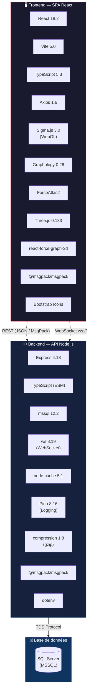

---

## 2 — Architecture Globale

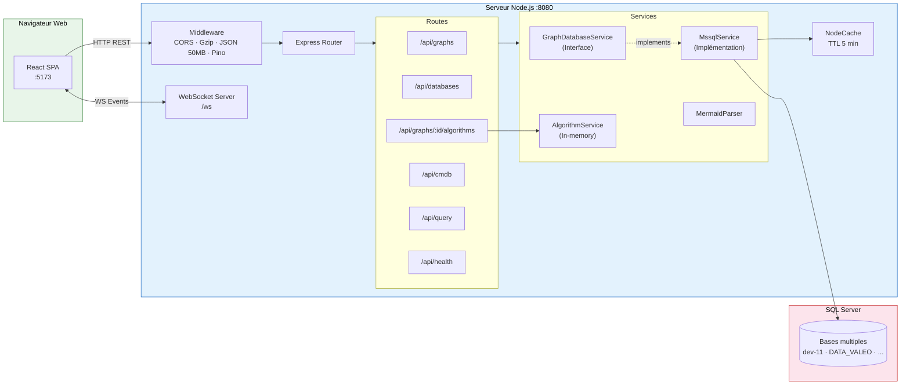

---

## 3 — Arborescence des fichiers

```mermaid
graph TB
    Root["node.js-graphe/"]
    
    subgraph BE["backend-nodejs/"]
        BE_SRC["src/"]
        BE_IDX["index.ts<br/>(Server + WS + Routes)"]
        BE_MODELS["models/"]
        BE_GRAPH_TS["graph.ts<br/>(Types partagés)"]
        BE_ROUTES["routes/"]
        BE_R1["graphRoutes.ts"]
        BE_R2["databaseRoutes.ts"]
        BE_R3["algorithmRoutes.ts"]
        BE_R4["cmdbRoutes.ts"]
        BE_SERVICES["services/"]
        BE_S1["GraphDatabaseService.ts<br/>(Interface)"]
        BE_S2["MssqlService.ts<br/>(~800 lignes)"]
        BE_S3["AlgorithmService.ts<br/>(14 algorithmes)"]
        BE_S4["MermaidParser.ts"]
    end
    
    subgraph FE["frontend-graph-viewer/"]
        FE_SRC["src/"]
        FE_APP["App.tsx<br/>(~20 useState)"]
        FE_COMP["components/"]
        FE_C1["SigmaGraphViewer.tsx<br/>(~1700 lignes)"]
        FE_C2["ForceGraph3DViewer.tsx"]
        FE_C3["ImpactAnalysis.tsx"]
        FE_C4["AlgorithmPanel.tsx"]
        FE_C5["SimulationPanel.tsx"]
        FE_C6["SqlQueryPanel.tsx"]
        FE_C7["GraphList.tsx"]
        FE_C8["ClassificationFilterPanel.tsx"]
        FE_C9["GraphFormModal.tsx"]
        FE_HOOKS["hooks/"]
        FE_H1["useTheme.ts"]
        FE_H2["useWebSocket.ts"]
        FE_SVC["services/"]
        FE_SVC1["api.ts<br/>(6 namespaces)"]
        FE_SVC2["graphTransform.ts"]
        FE_SVC3["nodePositionCache.ts"]
        FE_TYPES["types/"]
        FE_T1["graph.ts"]
    end

    Root --> BE
    Root --> FE
    BE --> BE_SRC
    BE_SRC --> BE_IDX
    BE_SRC --> BE_MODELS --> BE_GRAPH_TS
    BE_SRC --> BE_ROUTES
    BE_ROUTES --> BE_R1
    BE_ROUTES --> BE_R2
    BE_ROUTES --> BE_R3
    BE_ROUTES --> BE_R4
    BE_SRC --> BE_SERVICES
    BE_SERVICES --> BE_S1
    BE_SERVICES --> BE_S2
    BE_SERVICES --> BE_S3
    BE_SERVICES --> BE_S4
    FE --> FE_SRC
    FE_SRC --> FE_APP
    FE_SRC --> FE_COMP
    FE_COMP --> FE_C1
    FE_COMP --> FE_C2
    FE_COMP --> FE_C3
    FE_COMP --> FE_C4
    FE_COMP --> FE_C5
    FE_COMP --> FE_C6
    FE_COMP --> FE_C7
    FE_COMP --> FE_C8
    FE_COMP --> FE_C9
    FE_SRC --> FE_HOOKS
    FE_HOOKS --> FE_H1
    FE_HOOKS --> FE_H2
    FE_SRC --> FE_SVC
    FE_SVC --> FE_SVC1
    FE_SVC --> FE_SVC2
    FE_SVC --> FE_SVC3
    FE_SRC --> FE_TYPES --> FE_T1
```

---

## 4 — Modèle de données

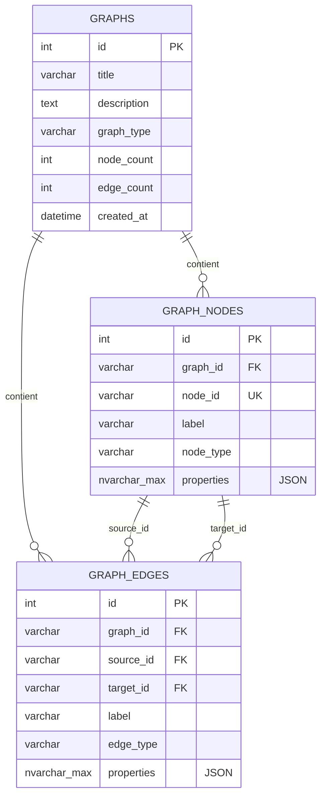

### Types TypeScript partagés

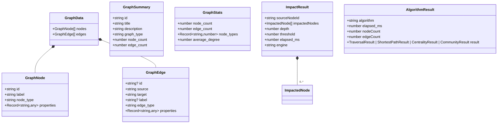

---

## 5 — Flux de requêtes HTTP

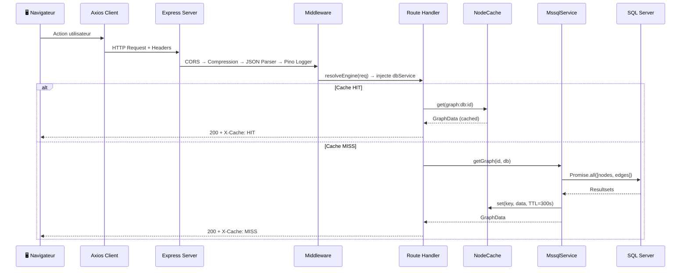

---

## 6 — Séquence de chargement initial

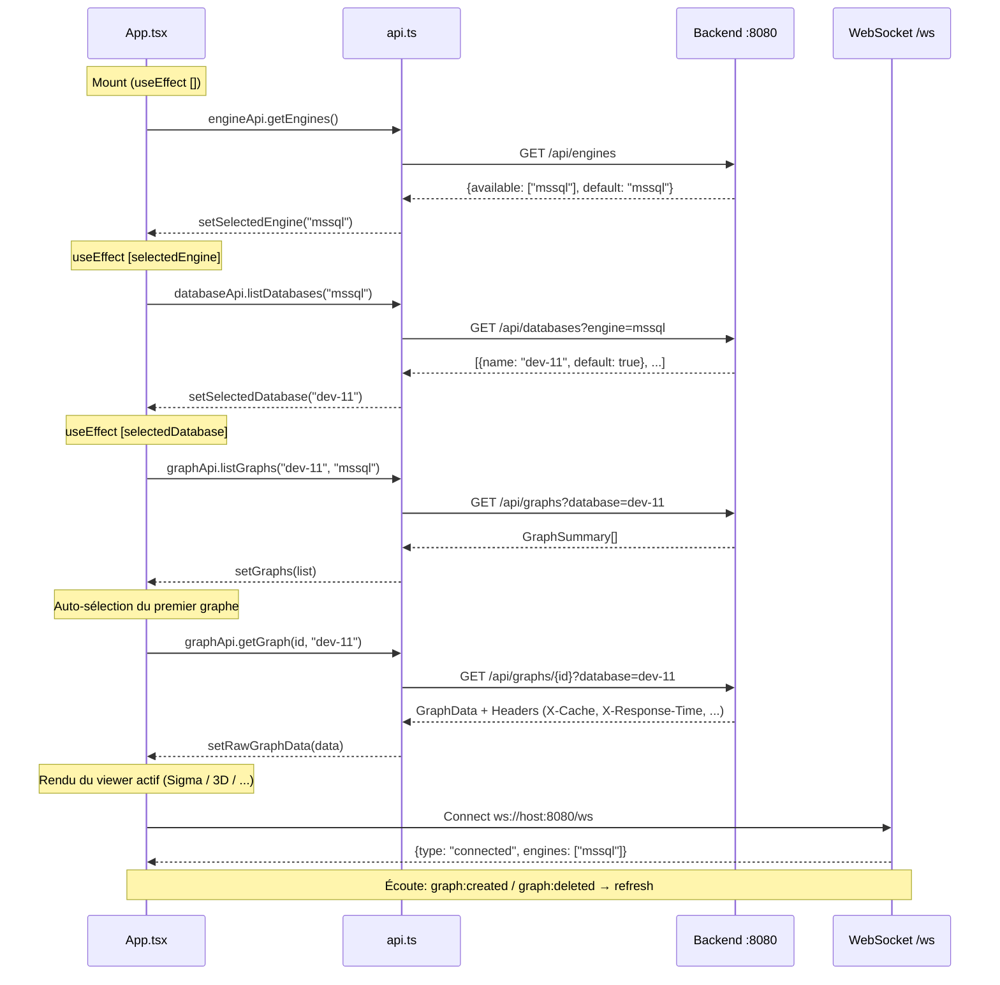

---

## 7 — Chaîne useEffect en cascade

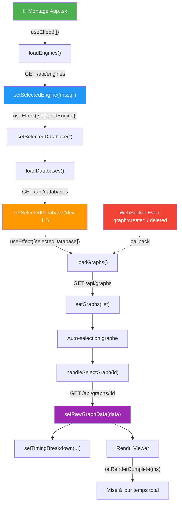

---

## 8 — Endpoints REST

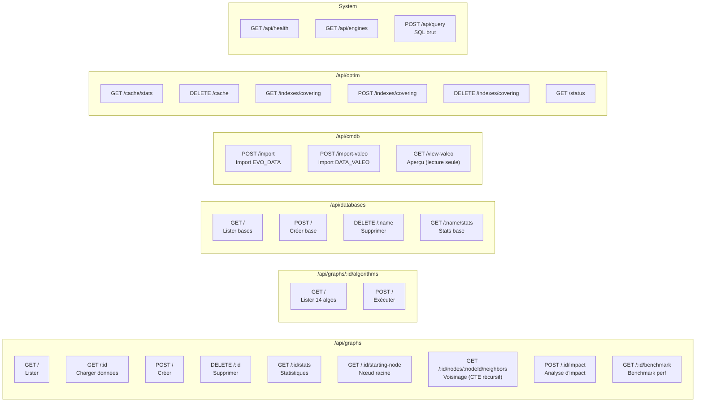

---

## 9 — Pipeline GET /api/graphs/:id

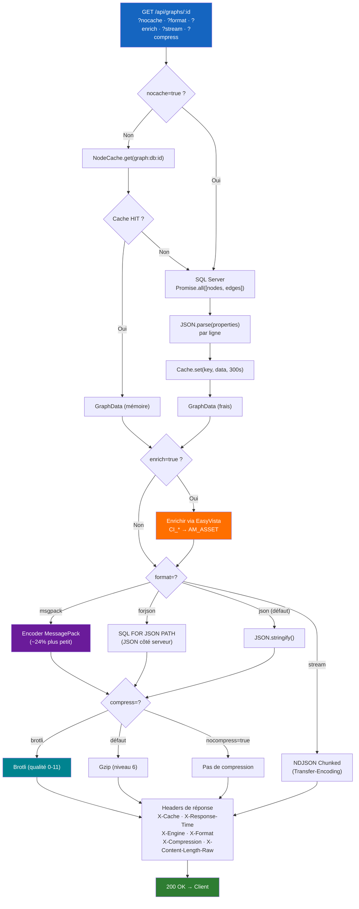

---

## 10 — Analyse d'impact

### Flux global

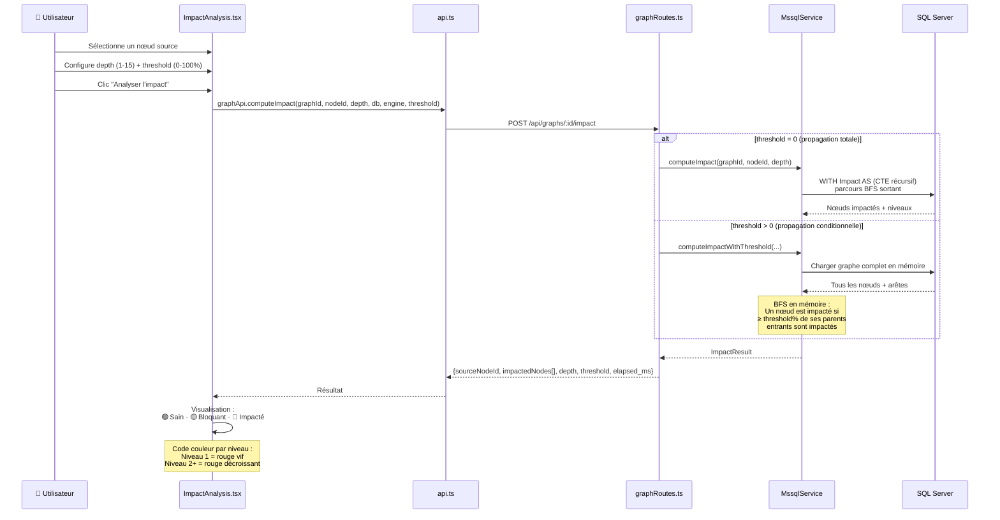

### Logique BFS avec seuil

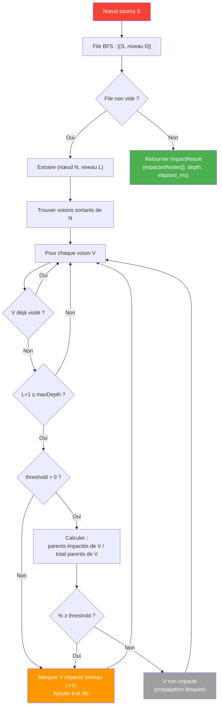

---

## 11 — Algorithmes de graphe

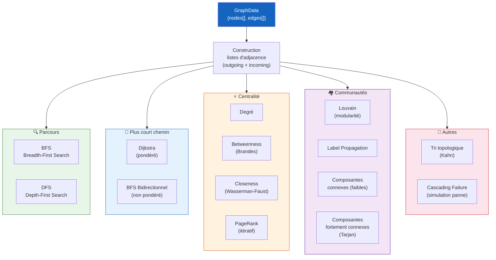

---

## 12 — Exécution d'un algorithme

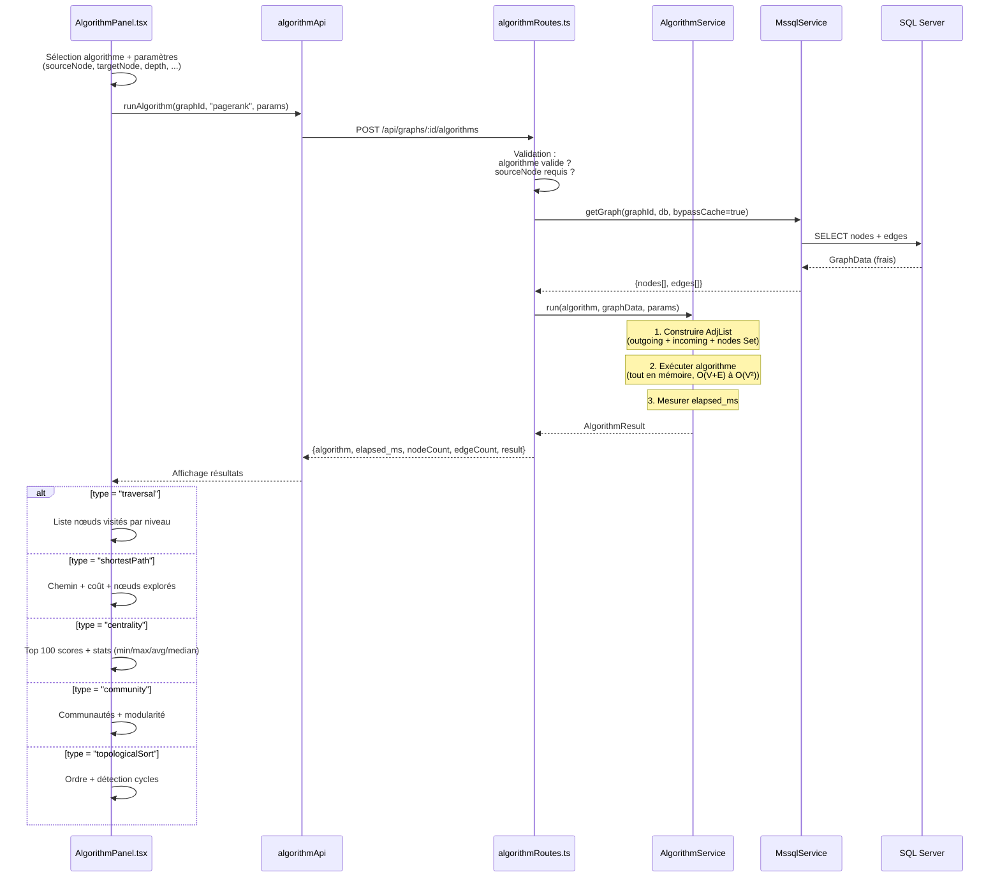

---

## 13 — Import CMDB

```mermaid
flowchart LR
    subgraph Source["Sources EasyVista"]
        EVO["EVO_DATA<br/>(schema 40000)"]
        VALEO["DATA_VALEO<br/>(schema 50004)"]
    end

    subgraph Import["Processus d'import"]
        LOAD_CI["1. Charger CIs<br/>AM_ASSET"]
        LOAD_CLASS["2. Joindre classification<br/>AM_UN_CLASSIFICATION"]
        LOAD_REL["3. Charger relations<br/>CONFIGURATION_ITEM_LINK"]
        FILTER["4. Filtrer arêtes<br/>(CIs importés uniquement)"]
        CREATE["5. Créer graphe<br/>cmdb_timestamp_random"]
    end

    subgraph Modes["Modes DATA_VALEO"]
        DEFAULT["default<br/>Sélection alphabétique"]
        CLUSTER["cluster<br/>Top N hubs + voisins"]
        CONNECTED["connected<br/>Top N par degré total"]
        SUBGRAPH_M["subgraph<br/>Par types classification"]
    end

    subgraph Output["Résultat"]
        GRAPH[("Graphe créé<br/>dans dev-11")]
        WS_EVT["WebSocket<br/>graph:created"]
    end

    EVO -->|"POST /api/cmdb/import"| LOAD_CI
    VALEO -->|"POST /api/cmdb/import-valeo"| LOAD_CI
    VALEO -->|"GET /api/cmdb/view-valeo"| Modes

    LOAD_CI --> LOAD_CLASS --> LOAD_REL --> FILTER --> CREATE
    Modes --> LOAD_CI
    CREATE --> GRAPH
    CREATE --> WS_EVT

    style EVO fill:#fff3e0,stroke:#e65100
    style VALEO fill:#e8f5e9,stroke:#2e7d32
    style GRAPH fill:#e3f2fd,stroke:#1565c0
    style WS_EVT fill:#fce4ec,stroke:#c62828
```

### Propriétés d'un nœud CMDB importé

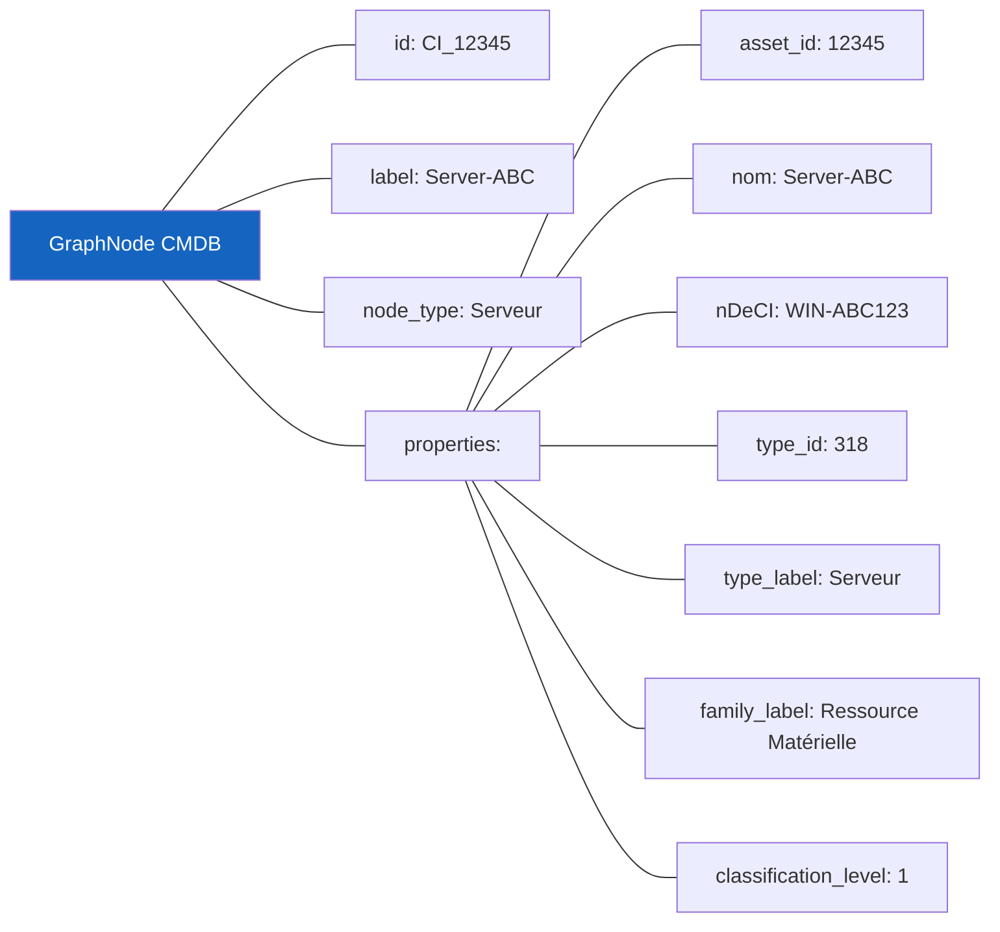

---

## 14 — WebSocket

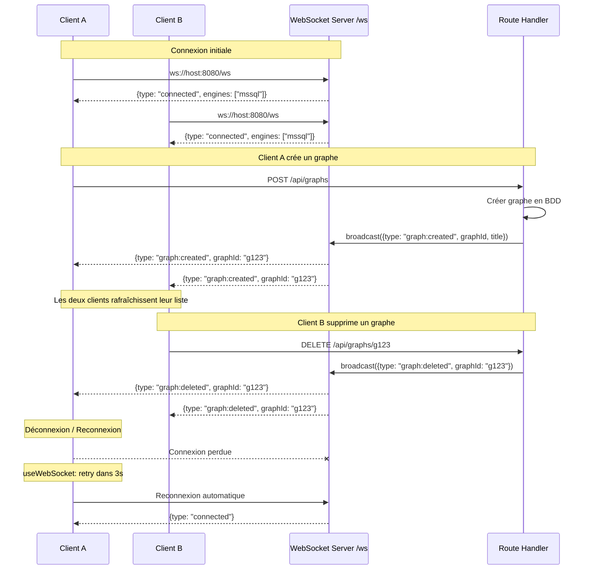

---

## 15 — Architecture Frontend

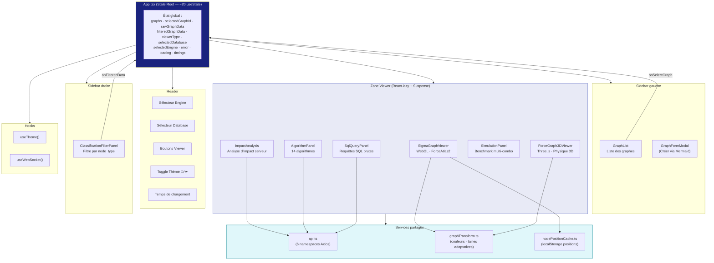

---

## 16 — Viewers interchangeables

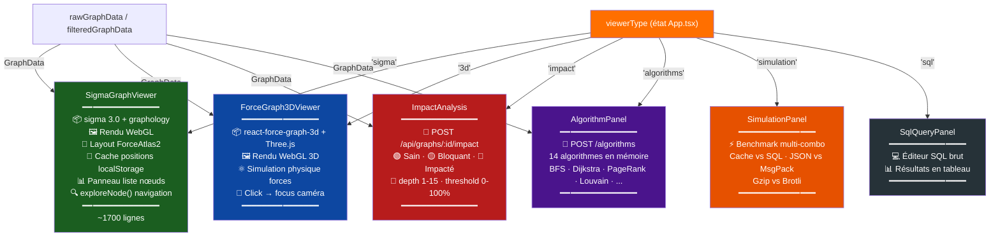

### Rendu adaptatif selon la taille du graphe

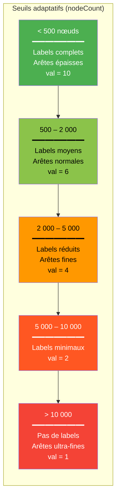

---

## 17 — Cache & Performance

```mermaid
flowchart TB
    subgraph Layers["Couches d'optimisation"]
        direction TB
        
        L1["1️⃣ Covering Indexes SQL<br/>IX_graph_nodes_covering<br/>IX_graph_edges_covering<br/>━━━━━━━━━━━━━━━━━<br/>Gain : ~50% sur requêtes SQL"]
        
        L2["2️⃣ Cache In-Memory (NodeCache)<br/>Clé : graph:{database}:{graphId}<br/>TTL : 300s (5 min)<br/>Bypass : ?nocache=true<br/>━━━━━━━━━━━━━━━━━<br/>Gain : ~50x vs SQL"]
        
        L3["3️⃣ Requêtes Parallèles<br/>Promise.all([nodes, edges])<br/>━━━━━━━━━━━━━━━━━<br/>Gain : ~2x vs séquentiel"]
        
        L4["4️⃣ MessagePack (binaire)<br/>@msgpack/msgpack<br/>━━━━━━━━━━━━━━━━━<br/>Gain : ~24% taille vs JSON"]
        
        L5["5️⃣ Compression réseau<br/>Gzip (défaut, niveau 6)<br/>Brotli (optionnel, qualité 0-11)<br/>━━━━━━━━━━━━━━━━━<br/>Gain : variable (~70-85%)"]
        
        L6["6️⃣ FOR JSON PATH<br/>JSON construit côté SQL Server<br/>━━━━━━━━━━━━━━━━━<br/>Évite JSON.parse par ligne"]
        
        L7["7️⃣ Streaming NDJSON<br/>Transfer-Encoding: chunked<br/>━━━━━━━━━━━━━━━━━<br/>TTFB amélioré gros graphes"]
    end

    L1 --> L2 --> L3 --> L4 --> L5

    subgraph Monitoring["Monitoring"]
        CACHE_STATS["GET /optim/cache/stats<br/>{hits, misses, bypasses, keys}"]
        OPTIM_STATUS["GET /optim/status<br/>{gzip, cache, indexes, msgpack, ...}"]
        BENCHMARK["GET /graphs/:id/benchmark<br/>SQL vs Cache vs JSON vs MsgPack"]
        HEADERS["Headers de réponse :<br/>X-Cache · X-Response-Time<br/>X-Compression · X-Format"]
    end

    style L1 fill:#1565c0,color:#fff
    style L2 fill:#2e7d32,color:#fff
    style L3 fill:#e65100,color:#fff
    style L4 fill:#6a1b9a,color:#fff
    style L5 fill:#00838f,color:#fff
    style L6 fill:#4e342e,color:#fff
    style L7 fill:#37474f,color:#fff
```

---

## 18 — Schéma SQL Server

```mermaid
flowchart TD
    subgraph SQLServer["SQL Server"]
        subgraph MasterDB["master"]
            SYS_DB["sys.databases<br/>(liste bases)"]
        end
        
        subgraph UserDB["Base utilisateur (ex: dev-11)"]
            GRAPHS_T["dbo.graphs<br/>━━━━━━━━━━━━━━━<br/>id VARCHAR PK<br/>title VARCHAR<br/>description TEXT<br/>graph_type VARCHAR<br/>node_count INT<br/>edge_count INT<br/>created_at DATETIME"]
            
            NODES_T["dbo.graph_nodes<br/>━━━━━━━━━━━━━━━<br/>id INT IDENTITY PK<br/>graph_id VARCHAR FK<br/>node_id VARCHAR<br/>label VARCHAR<br/>node_type VARCHAR<br/>properties NVARCHAR(MAX)"]
            
            EDGES_T["dbo.graph_edges<br/>━━━━━━━━━━━━━━━<br/>id INT IDENTITY PK<br/>graph_id VARCHAR FK<br/>source_id VARCHAR<br/>target_id VARCHAR<br/>label VARCHAR<br/>edge_type VARCHAR<br/>properties NVARCHAR(MAX)"]
            
            IDX1["IX_graph_nodes_covering<br/>(graph_id) INCLUDE (node_id, label,<br/>node_type, properties)"]
            IDX2["IX_graph_edges_covering<br/>(graph_id) INCLUDE (id, source_id,<br/>target_id, label, edge_type, properties)"]
        end
        
        subgraph CMDB_DB["DATA_VALEO / EVO_DATA"]
            AM_ASSET["AM_ASSET<br/>(CIs / Actifs)"]
            AM_CLASS["AM_UN_CLASSIFICATION<br/>(Familles / Types)"]
            CI_LINK["CONFIGURATION_ITEM_LINK<br/>(Relations entre CIs)"]
        end
    end

    GRAPHS_T -->|"1:N"| NODES_T
    GRAPHS_T -->|"1:N"| EDGES_T
    IDX1 -.->|"couvre"| NODES_T
    IDX2 -.->|"couvre"| EDGES_T
    
    AM_ASSET -->|"JOIN"| AM_CLASS
    AM_ASSET -->|"FK"| CI_LINK

    style MasterDB fill:#ffecb3,stroke:#ff8f00
    style UserDB fill:#e3f2fd,stroke:#1565c0
    style CMDB_DB fill:#e8f5e9,stroke:#2e7d32
```

### Contraintes MSSQL

```mermaid
graph LR
    C1["⚠️ Limite 2100 paramètres<br/>→ Batch 500 nœuds<br/>→ Batch 400 arêtes"]
    C2["⚠️ CTE MAXRECURSION 200<br/>→ Profondeur limitée<br/>pour voisinage/impact"]
    C3["⚠️ Pool par base<br/>Map‹string, ConnectionPool›<br/>Max 10 connexions<br/>Idle timeout 30s"]
    C4["⚠️ Request timeout<br/>600 000 ms (10 min)<br/>Pour gros imports"]

    style C1 fill:#fff3e0,stroke:#e65100
    style C2 fill:#fff3e0,stroke:#e65100
    style C3 fill:#fff3e0,stroke:#e65100
    style C4 fill:#fff3e0,stroke:#e65100
```

---

## 19 — Gestion multi-bases

```mermaid
sequenceDiagram
    participant UI as Frontend
    participant API as Backend
    participant Pool as Pool Manager
    participant SQL as SQL Server

    UI->>API: GET /api/databases
    API->>SQL: SELECT FROM sys.databases<br/>(exclut master, tempdb, model, msdb)
    SQL-->>API: [{name: "dev-11"}, {name: "DATA_VALEO"}, ...]
    API-->>UI: databases[]

    Note over UI: L'utilisateur change de base

    UI->>API: GET /api/graphs?database=DATA_VALEO
    API->>Pool: getPool("DATA_VALEO")
    
    alt Pool existant
        Pool-->>API: ConnectionPool (réutilisé)
    else Nouveau pool
        Pool->>SQL: new ConnectionPool(config + database)
        Pool->>SQL: ensureTables() — CREATE IF NOT EXISTS
        SQL-->>Pool: Tables prêtes
        Pool-->>API: ConnectionPool (nouveau)
    end
    
    API->>SQL: SELECT * FROM graphs (via pool)
    SQL-->>API: GraphSummary[]
    API-->>UI: Liste des graphes de DATA_VALEO

    Note over UI: Création d'une nouvelle base

    UI->>API: POST /api/databases {name: "test-db"}
    API->>SQL: CREATE DATABASE [test-db]
    API->>Pool: getPool("test-db") → ensureTables()
    API-->>UI: {message: "Created", name: "test-db"}

    Note over UI: Suppression d'une base

    UI->>API: DELETE /api/databases/test-db
    API->>API: Vérification : pas default/protégée
    API->>SQL: ALTER DATABASE SET SINGLE_USER + DROP
    API->>Pool: pool.close() + pools.delete("test-db")
    API-->>UI: {message: "Deleted"}
```

---

## Résumé des librairies par rôle

```mermaid
mindmap
    root((Graph Visualizer))
        Backend
            Express 4.18
                Routes REST
                Middleware
            mssql 12.2
                Connection Pools
                CTE récursifs
                FOR JSON PATH
            ws 8.19
                Événements temps réel
            node-cache 5.1
                TTL 5 min
                Bypass nocache
            pino 8.16
                Logging HTTP
                SQL query log
            compression 1.8
                Gzip niveau 6
            msgpack 3.1
                Sérialisation binaire
            dotenv
                Variables env
        Frontend
            React 18.2
                useState ×20
                useEffect cascade
                React.lazy
            Vite 5.0
                HMR
                Build prod
            TypeScript 5.3
                Strict mode
                ES2020
            sigma 3.0
                WebGL rendu
                ForceAtlas2
            graphology 0.26
                Structure graphe
            three.js 0.183
                Rendu 3D
            react-force-graph-3d
                Physique forces
            Axios 1.6
                Client HTTP
                Intercepteurs
            msgpack 3.1
                Décodage binaire
```
