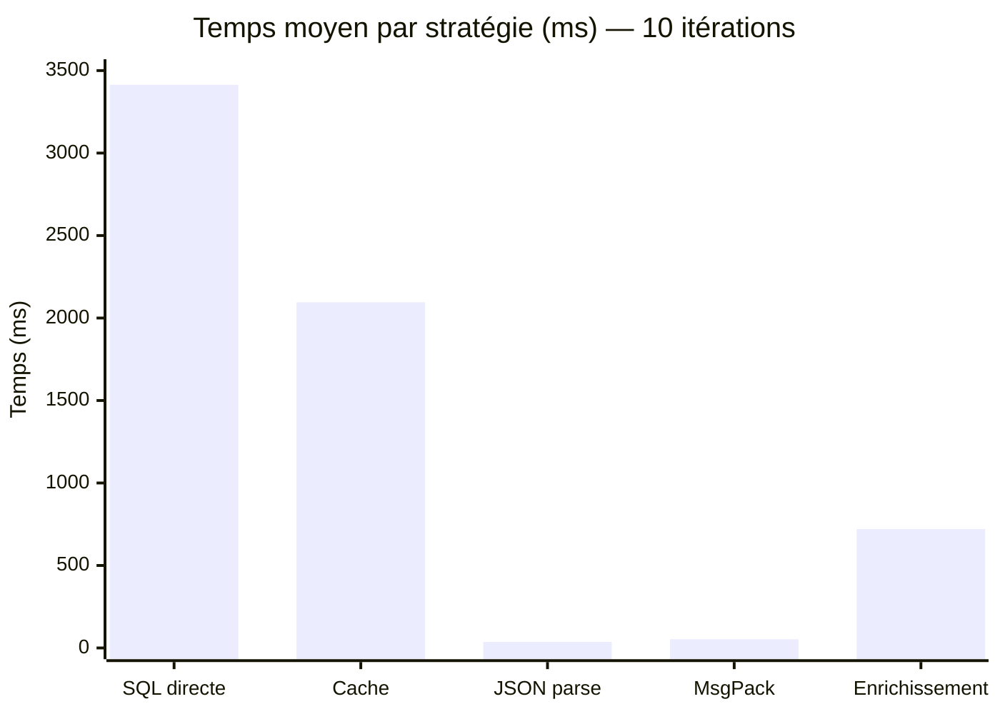
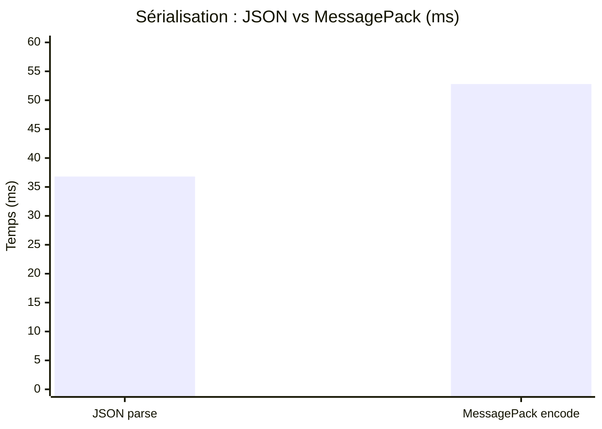
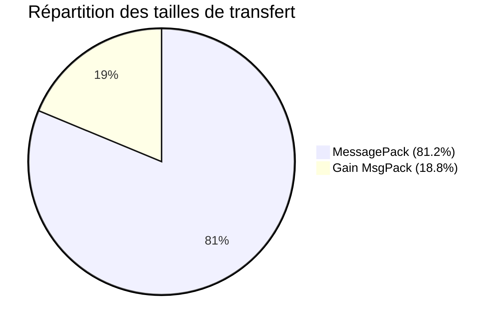
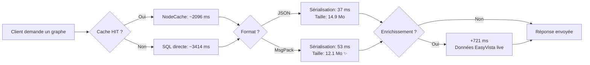
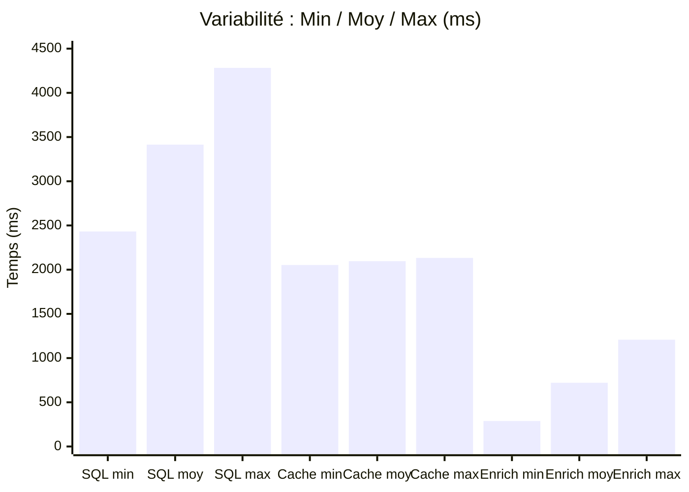

# Benchmark de Performance — Graph Visualizer

> **Date** : 13 mars 2026  
> **Graphe** : VALEO G9 — 20 000 nœuds / 50 000 arêtes  
> **Base** : DATA_VALEO (MSSQL)  
> **Itérations** : 10  
> **Covering Indexes** : ❌ inactifs

---

## Résultats bruts (10 itérations)

| Stratégie | Moy. (ms) | Min (ms) | Max (ms) | Écart |
|-----------|-----------|----------|----------|-------|
| 🔴 Requête SQL directe | **3 413.8** | 2 432.0 | 4 282.0 | 1 850 |
| 🟡 Cache NodeCache | **2 095.6** | 2 052.9 | 2 133.5 | 81 |
| 🟢 JSON parse | **36.8** | 33.7 | 46.6 | 13 |
| 🔵 MessagePack encode | **52.8** | 45.6 | 61.6 | 16 |
| 🟠 Enrichissement EasyVista | **720.8** | 287.7 | 1 207.8 | 920 |

---

## Diagramme des temps moyens



## Diagramme sérialisation (zoom)



---

## Taille des données (transfert réseau)

| Format | Taille | Réduction |
|--------|--------|-----------|
| JSON | **14 908.7 Ko** (14.6 Mo) | — |
| MessagePack | **12 113.3 Ko** (11.8 Mo) | **−18.8%** |



---

## Gains de performance (speedup)

| Comparaison | Facteur | Interprétation |
|-------------|---------|----------------|
| Cache vs SQL | **1.6×** | Le cache réduit le temps de 38% |
| JSON vs SQL | **92.7×** | La sérialisation est 93× plus rapide que la requête SQL |
| MsgPack vs JSON | **0.7×** | MessagePack est plus lent à encoder côté serveur |

### Analyse



---

## Distribution des temps (variabilité)



**Observations :**
- **SQL** : forte variabilité (±54%) — dépend de la charge SQL Server
- **Cache** : très stable (±2%) — performances prévisibles
- **Enrichissement** : haute variabilité (±64%) — dépend du réseau et de la charge EasyVista

---

## Recommandations

### ✅ Optimisations à activer en production

1. **Cache NodeCache** — toujours actif (gain constant de 1.6×)
2. **Covering Indexes** — à créer (accélère les requêtes SQL, actuellement inactifs)
3. **MessagePack** — recommandé pour les clients distants (−18.8% de bande passante)

### ⚠️ Optimisations conditionnelles

4. **Enrichissement EasyVista** — utile pour les graphes CMDB avec nœuds CI_, mais ajoute ~721 ms
5. **Gzip** — compression serveur activée par défaut (réduit davantage le JSON/MsgPack compressé)

### 📊 Configuration optimale (onglet "Sigma ⚡")

L'onglet **Sigma ⚡** dans l'interface active automatiquement :
- ✅ MessagePack (format binaire)
- ✅ Enrichissement EasyVista
- ✅ Covering Indexes (si créés)

---

## Reproduction

```bash
# Benchmark via API (10 itérations)
curl "http://localhost:8080/api/graphs/graph_1773223493228_uz53irs5r-dev11/benchmark?database=DATA_VALEO&iterations=10"

# Ou via l'interface : Panneau ⚡ > Benchmark serveur > Itérations: 10
```
