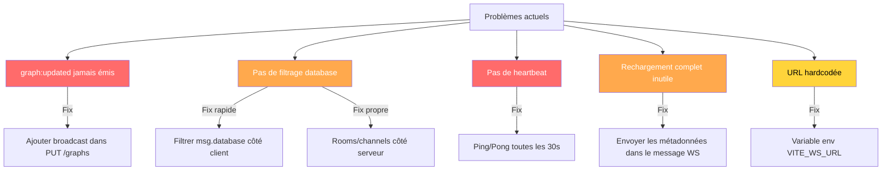

# Pistes d'amélioration — Graph Visualizer

---

## 1. Ce qui manque au projet

### 1.1 Tests (couverture à 0 %)

Le backend déclare `"test": "echo \"Tests not implemented yet\" && exit 0"`. Le frontend n'a aucun script test. Aucun test unitaire, d'intégration ni E2E n'existe.

**Ce qu'il faudrait ajouter en priorité :**

| Cible | Type | Exemple |
|-------|------|---------|
| `AlgorithmService` | Unitaire | Vérifier BFS/DFS sur un graphe connu (5 nœuds, résultat attendu) |
| `MssqlService.getGraph` | Intégration | Créer un graphe → le relire → comparer les données |
| Batching 2100 params | Unitaire | Insérer 3 000 nœuds, vérifier qu'aucun n'est perdu |
| `graphRoutes` | Intégration | `supertest` : POST /api/graphs → GET → DELETE |
| Composants React | Snapshot | Rendre `GraphList` avec des mocks → vérifier le HTML |
| Flux complet | E2E (Playwright) | Créer graphe → le voir dans Sigma → supprimer |

**Outils recommandés :** Vitest (frontend + backend, même écosystème Vite), Playwright pour E2E.

### 1.2 Linting et formatage

Les scripts `npm run lint` existent dans les deux packages mais **aucun fichier de configuration** (`.eslintrc`, `.prettierrc`) n'est présent. Le lint échoue silencieusement.

**À ajouter :**
- `.eslintrc.cjs` avec les règles TypeScript + React Hooks
- `.prettierrc` avec les conventions du projet (semicolons, single quotes, etc.)
- Hook pre-commit (`husky` + `lint-staged`) pour empêcher le code non formaté d'être commité

### 1.3 Error Boundary React

Aucun `ErrorBoundary` n'existe. Si un viewer crash (ex : WebGL context lost dans Cosmos, erreur dans Sigma), **l'application entière plante** avec un écran blanc.

```tsx
// À ajouter dans App.tsx autour de chaque viewer
<ErrorBoundary fallback={<div>Ce viewer a planté. <button>Réessayer</button></div>}>
  <SigmaGraphViewer ... />
</ErrorBoundary>
```

### 1.4 Gestion d'état centralisée

`App.tsx` contient ~20 `useState` et communique avec `OptimPanel` via **3 variables globales `window.__optim*`**. C'est fragile, non typé, et invisible au React DevTools.

**Ce qui manque :** un store léger (Zustand, 2 Ko gzippé) ou au minimum un `React.createContext` pour partager l'état optim sans passer par `window`.

### 1.5 Annulation des requêtes

Quand l'utilisateur change de graphe rapidement, les requêtes API en cours ne sont **jamais annulées**. Une réponse tardive peut écraser le graphe que l'utilisateur vient de sélectionner.

**Solution :** `AbortController` sur chaque appel `getGraph()` dans `api.ts`, annulé dans le cleanup du `useEffect`.

### 1.6 Documentation API (OpenAPI / Swagger)

Aucune documentation interactive des routes API. Les consommateurs doivent lire le code pour comprendre les endpoints, les query params (`?nocache`, `?format=msgpack`, `?enrich`, `?nocompress`), et les formats de réponse.

**À ajouter :** `swagger-jsdoc` + `swagger-ui-express` ou un fichier `openapi.yaml` statique.

### 1.7 Healthcheck structuré

Le `GET /api/health` actuel renvoie un simple `{ status: "ok" }`. Il ne vérifie pas la connexion MSSQL, l'état du cache, ni la mémoire disponible.

```typescript
// Healthcheck amélioré
GET /api/health → {
  status: "ok",
  uptime: 3600,
  mssql: { connected: true, poolSize: 3 },
  cache: { keys: 12, hits: 450, misses: 23 },
  memory: { heapUsed: "120 MB", rss: "180 MB" }
}
```

---

## 2. Ce qui peut être amélioré

### 2.1 Logging incohérent

Le backend utilise **deux systèmes en parallèle** :
- `pino` (logger structuré) dans `index.ts`
- `console.log` / `console.error` dans les services et routes (~15 occurrences backend, ~31 frontend)

Le `MssqlService` a même son propre système CSV dans `logs/sql-queries.log`.

**Amélioration :** Remplacer tous les `console.*` par le logger pino existant. Ajouter un `requestId` (correlation ID) via `pino-http` pour tracer une requête du endpoint jusqu'au SQL.

### 2.2 Typage TypeScript (~70+ `as any`)

Le code utilise `as any` massivement :
- `(req as any).dbService` dans chaque route (le middleware `resolveEngine` injecte sans type)
- `(r: any) =>` dans les `.map()` des recordsets MSSQL
- `catch (err: any)` partout
- Le error handler global : `(err: any, req: any, res: any, next: any)`

**Amélioration :**
```typescript
// Typer le middleware resolveEngine
interface GraphRequest extends Request {
  dbService: GraphDatabaseService;
}

// Typer les recordsets
interface NodeRow { node_id: string; label: string; node_type: string; properties: string; }
const nodes = nodesRes.recordset as NodeRow[];
```

### 2.3 `SigmaGraphViewer.tsx` — 1 760 lignes

Le plus gros composant du projet. Il contient dans un seul fichier :
- 650+ lignes de mapping d'icônes (constantes)
- Le rendu du graphe Sigma
- Le panneau de liste des nœuds
- La logique ForceAtlas2
- Le cache de positions (localStorage)
- L'exploration de nœuds (`exploreNode`)

**Découpage recommandé :**

| Fichier | Contenu | ~LOC |
|---------|---------|------|
| `iconMapping.ts` | Constantes `NODE_ICON_MAP` | 300 |
| `SigmaNodePanel.tsx` | Panneau latéral liste nœuds | 200 |
| `SigmaLayoutEngine.ts` | ForceAtlas2 + circular + random | 200 |
| `SigmaGraphViewer.tsx` | Composant principal allégé | 500 |
| `useNodePositionCache.ts` | Hook localStorage positions | 100 |

### 2.4 Compression Gzip ignorée pour MsgPack

Le middleware `compression()` utilise le filtre par défaut qui **ne reconnaît pas `application/x-msgpack`**. Résultat : MsgPack transite en clair (~12 Mo) alors que JSON compressé par gzip ne fait que ~1.5 Mo.

```typescript
// Fix : 1 ligne dans index.ts
app.use(compression({
  filter: (req, res) => {
    if (req.query.nocompress === 'true') return false;
    const ct = res.getHeader('Content-Type')?.toString() || '';
    if (ct.includes('msgpack') || ct.includes('octet-stream')) return true;
    return compression.filter(req, res);
  },
}));
```

### 2.5 Dépendances inutilisées (poids mort)

| Package | Taille | Statut |
|---------|--------|--------|
| `@antv/g6` | ~2 Mo | Bouton masqué dans App.tsx, jamais rendu |
| `cytoscape` + `@types/cytoscape` | ~1.5 Mo | Installé, jamais importé nulle part |

Ces deux paquets ajoutent ~3.5 Mo au `node_modules` et potentiellement au bundle si le tree-shaking ne les exclut pas totalement.

### 2.6 Code splitting (lazy loading des viewers)

Actuellement, **tous les viewers sont importés statiquement** dans `App.tsx` :

```typescript
import { SigmaGraphViewer } from './components/SigmaGraphViewer';
import { CosmosViewer } from './components/CosmosViewer';
import { ForceGraph3DViewer } from './components/ForceGraph3DViewer';
// ... 6 imports de plus
```

L'utilisateur n'utilise qu'un seul viewer à la fois, mais le bundle embarque les 10. Avec `React.lazy()` :

```typescript
const SigmaGraphViewer = React.lazy(() => import('./components/SigmaGraphViewer'));
const CosmosViewer = React.lazy(() => import('./components/CosmosViewer'));
// Chaque viewer = un chunk séparé, chargé à la demande
```

**Gain estimé :** bundle initial réduit de 40-60 %.

### 2.7 Absence de métriques de performance côté client

Il n'y a aucun suivi du temps de rendu des viewers (combien de temps entre le chargement des données et le premier affichage du graphe). Le `FpsCounter` mesure les FPS en temps réel mais pas le "Time to Interactive".

**Amélioration :** `performance.mark()` / `performance.measure()` dans chaque viewer pour mesurer :
- Temps de transformation des données
- Temps de premier rendu
- Temps du layout (ForceAtlas2, etc.)

### 2.8 Reconnexion WebSocket sans backoff exponentiel

Le hook `useWebSocket` tente une reconnexion toutes les 3 secondes, indéfiniment. Si le serveur est down 10 minutes, ça fait 200 tentatives inutiles.

```typescript
// Actuel : retry fixe 3s
reconnectTimerRef.current = setTimeout(connect, 3000);

// Mieux : backoff exponentiel avec plafond
const delay = Math.min(3000 * Math.pow(2, retryCount), 30000);
reconnectTimerRef.current = setTimeout(connect, delay);
```

### 2.9 URL du serveur hardcodée

L'URL `ws://172.23.0.162:8080/ws` est écrite en dur dans `useWebSocket.ts`. L'URL API `http://172.23.0.162:8080/api` est aussi dans `api.ts`. Pas de variable d'environnement Vite.

```typescript
// À remplacer par :
const WS_URL = import.meta.env.VITE_WS_URL || `ws://${window.location.hostname}:8080/ws`;
const API_URL = import.meta.env.VITE_API_URL || `http://${window.location.hostname}:8080/api`;
```

### 2.10 Pas de memoization des callbacks React

Dans `App.tsx`, des fonctions comme `handleSelectGraph`, `handleDeleteGraph`, `loadGraphs` sont recréées à chaque render. Elles sont passées en props aux composants enfants, provoquant des re-renders inutiles.

**Fix :** Envelopper avec `useCallback` et utiliser `React.memo` sur les composants enfants (viewers, panels).

---

## 3. Technologies non utilisées qui seraient intéressantes

### 3.1 Pour le backend

| Technologie | Intérêt pour ce projet | Effort |
|-------------|----------------------|--------|
| **Redis** | Cache distribué remplaçant `NodeCache` (in-memory). Survit aux redémarrages serveur, partageable entre instances. TTL natif. | Moyen |
| **Fastify** | Remplacement d'Express. 2-3× plus rapide en throughput, validation JSON Schema native, sérialisation rapide. Même API. | Moyen |
| **tRPC** | Remplace REST par des appels typés de bout en bout (frontend ↔ backend). Élimine tous les `as any` dans api.ts. | Élevé |
| **Drizzle ORM** | Query builder TypeScript type-safe. Remplacerait les requêtes SQL raw dans MssqlService. Plus lisible, autocomplétion. | Moyen |
| **BullMQ** (+ Redis) | File de jobs pour les imports CMDB lourds et les calculs d'algorithmes. Évite de bloquer l'event loop Express. | Moyen |
| **Zod** | Validation des données entrantes (body des POST, query params). Remplace les `if (!req.body.title)` manuels. | Faible |
| **pino-pretty** | Logs lisibles en dev (couleurs, timestamps formatés). Zéro impact en prod. | Faible |
| **Protobuf (protobufjs)** | Alternative à MsgPack avec schéma strict. Plus compact (~30% vs JSON), decode plus rapide, mais nécessite de définir les `.proto`. | Moyen |
| **better-sqlite3** | Moteur graph alternatif ultra-rapide en local. Le `GraphDatabaseService` est déjà conçu pour accueillir un 2e moteur. | Moyen |

### 3.2 Pour le frontend

| Technologie | Intérêt pour ce projet | Effort |
|-------------|----------------------|--------|
| **Zustand** | Store global (2 Ko). Remplacerait les 20 `useState` + les `window.__optim*`. Un seul `useStore()` partout. | Faible |
| **TanStack Query (React Query)** | Gestion du cache côté client, auto-refetch, invalidation, retry, loading/error states. Remplacerait les `useEffect` + `useState` manuels pour chaque appel API. | Moyen |
| **Vitest** | Testing framework compatible Vite. Config zéro, JSX/TSX natif. Remplacerait le `"test"` no-op. | Faible |
| **Playwright** | E2E testing avec screenshot comparison. Idéal pour tester les viewers graphiques. | Moyen |
| **Web Workers** | Déporter ForceAtlas2 et les algorithmes lourds hors du thread principal. Élimine les freezes UI sans les `yieldToBrowser()`. | Moyen |
| **OffscreenCanvas** | Rendu Sigma/Cosmos dans un Worker. Le thread principal ne bloque jamais, même pendant le layout. | Élevé |
| **Comlink** | Simplifie la communication avec les Web Workers (appels async transparents). | Faible |
| **React Virtuoso / react-window** | Virtualisation de la liste de nœuds dans SigmaGraphViewer (actuellement limitée à 5 000 entrées, affichées toutes en DOM). | Faible |
| **Jotai** | Alternative atomique à Zustand. Chaque état (engine, database, graphId) = un atome indépendant. Re-renders ultra-ciblés. | Faible |

### 3.3 Pour le DevOps / DX

| Technologie | Intérêt | Effort |
|-------------|---------|--------|
| **Docker Compose** | Conteneuriser backend + frontend + SQL Server. `docker compose up` pour tout démarrer. | Moyen |
| **GitHub Actions** | CI : typecheck + lint + tests à chaque push. | Faible |
| **Turborepo / Nx** | Gestionnaire de monorepo. Build/test parallélisés, cache de build intelligent. | Moyen |
| **Changesets** | Gestion de versions et CHANGELOG automatique entre les 2 packages. | Faible |

---

## 4. Problèmes actuels du temps réel (WebSocket)

### 4.1 Problème : `graph:updated` déclaré mais jamais émis

Le type `WsMessage` dans `useWebSocket.ts` déclare trois événements :

```typescript
type: 'graph:created' | 'graph:deleted' | 'graph:updated'
```

Mais côté backend, **seuls `graph:created` et `graph:deleted` sont broadcastés** (dans `graphRoutes.ts` et `cmdbRoutes.ts`). L'événement `graph:updated` **n'existe pas côté serveur**.

**Conséquence :** Si un utilisateur modifie un graphe (ajout/suppression de nœuds via QueryPanel ou import CMDB partiel), les autres clients connectés **ne voient rien changer**. Ils doivent rafraîchir manuellement.

**Correction :**

```typescript
// backend — graphRoutes.ts, après un PUT /api/graphs/:id ou un updateGraph
broadcast?.({
  type: "graph:updated",
  graphId: id,
  engine: engineName,
  database: databaseName,
});

// frontend — App.tsx, dans handleWsMessage
if (msg.type === 'graph:updated' && msg.graphId === selectedGraphId) {
  // Recharger les données du graphe actuellement affiché
  loadGraphData(msg.graphId);
}
```

### 4.2 Problème : pas de filtrage par database/engine

Le backend broadcast **à tous les clients** sans distinction. Si 5 utilisateurs regardent 5 databases différentes, chacun reçoit les événements des 4 autres.

**Conséquence actuelle :** `App.tsx` recharge `loadGraphs()` à chaque événement, même si le graphe créé/supprimé est dans une autre database. C'est un appel API inutile.

```typescript
// Actuel — App.tsx ligne 50
const handleWsMessage = useCallback((msg: WsMessage) => {
  if (msg.type === 'graph:created' || msg.type === 'graph:deleted') {
    loadGraphs();  // ← toujours appelé, même pour une autre DB
  }
}, []);
```

**Correction côté frontend (rapide) :**

```typescript
const handleWsMessage = useCallback((msg: WsMessage) => {
  if (msg.type === 'graph:created' || msg.type === 'graph:deleted') {
    // Ne recharger que si c'est la même database
    if (!msg.database || msg.database === selectedDatabase) {
      loadGraphs();
    }
  }
}, [selectedDatabase]);
```

**Correction côté backend (plus propre) :** Implémenter un système de **rooms/channels** — chaque client s'abonne à une database lors de la connexion :

```typescript
// Client envoie après connexion :
ws.send(JSON.stringify({ type: 'subscribe', database: 'DATA_VALEO' }));

// Serveur stocke l'abonnement et ne broadcast qu'aux clients abonnés
function broadcastToDatabase(database: string, message: Record<string, any>) {
  const data = JSON.stringify(message);
  wss.clients.forEach((client) => {
    if (client.readyState === WebSocket.OPEN && client.subscribedDatabase === database) {
      client.send(data);
    }
  });
}
```

### 4.3 Problème : pas de heartbeat / détection de connexion morte

Le serveur WebSocket ne vérifie jamais si un client est encore vivant. Si un client perd sa connexion réseau sans envoyer de `close` (ex : mise en veille du PC, coupure WiFi), le serveur **garde la connexion zombie indéfiniment** dans `wss.clients`.

**Conséquences :**
- `broadcast()` tente d'envoyer à des clients morts (appels inutiles)
- `wss.clients.size` augmente sans limite → fuite mémoire lente
- Le client ne sait qu'il est déconnecté qu'au prochain envoi (qui échoue)

**Correction — Ping/Pong côté serveur :**

```typescript
// backend — index.ts, après wss.on('connection')
const HEARTBEAT_INTERVAL = 30_000; // 30 secondes

wss.on('connection', (ws) => {
  (ws as any).isAlive = true;

  ws.on('pong', () => {
    (ws as any).isAlive = true;
  });

  ws.on('close', () => logger.info('WS client disconnected'));
});

// Vérification périodique
setInterval(() => {
  wss.clients.forEach((ws) => {
    if (!(ws as any).isAlive) {
      return ws.terminate(); // Kill les connexions zombies
    }
    (ws as any).isAlive = false;
    ws.ping(); // Le client doit répondre 'pong'
  });
}, HEARTBEAT_INTERVAL);
```

### 4.4 Problème : pas de synchronisation des données en temps réel

Actuellement le WebSocket ne sert qu'à **notifier que la liste des graphes a changé** (`graph:created`, `graph:deleted`). Il ne transmet **aucune donnée**.

Quand un événement arrive, le frontend fait un appel HTTP complet `GET /api/graphs` pour recharger la liste entière. Pour un graphe de 20K nœuds, ça représente ~15 Mo de données rechargées juste pour savoir qu'un nouveau graphe de 5 nœuds a été ajouté à la liste.

**Amélioration progressive :**

| Niveau | Description | Impact |
|--------|-------------|--------|
| **1. Métadonnées dans l'événement** | Inclure `{ graphId, title, node_count, edge_count }` dans le message WS. Le frontend l'ajoute à la liste sans refetch. | -1 appel API par événement |
| **2. Delta updates** | Lors d'un `updateGraph`, envoyer uniquement les nœuds/arêtes modifiés via WS. Le frontend applique le diff. | -15 Mo par mise à jour |
| **3. CRDT / OT** | Édition collaborative temps réel avec résolution de conflits. Hors scope actuel. | Collectif |

**Implémentation du niveau 1 :**

```typescript
// Backend — graphRoutes.ts, lors d'un POST /api/graphs
broadcast?.({
  type: "graph:created",
  graphId: id,
  title: body.title,
  node_count: body.nodes.length,
  edge_count: body.edges.length,
  database: databaseName,
});

// Frontend — App.tsx
const handleWsMessage = useCallback((msg: WsMessage) => {
  if (msg.type === 'graph:created' && msg.database === selectedDatabase) {
    // Ajouter directement à la liste sans refetch
    setGraphs(prev => [...prev, {
      id: msg.graphId!,
      title: msg.title || 'Sans titre',
      node_count: msg.node_count || 0,
      edge_count: msg.edge_count || 0,
    }]);
  }
  if (msg.type === 'graph:deleted') {
    setGraphs(prev => prev.filter(g => g.id !== msg.graphId));
  }
}, [selectedDatabase]);
```

### 4.5 Problème : URL WebSocket hardcodée

```typescript
// useWebSocket.ts — ligne 31
const ws = new WebSocket('ws://172.23.0.162:8080/ws');
```

L'IP du serveur est écrite en dur. Si le backend change de machine ou de port, il faut modifier le code source.

**Correction :**

```typescript
const wsUrl = import.meta.env.VITE_WS_URL
  || `ws://${window.location.hostname}:8080/ws`;
const ws = new WebSocket(wsUrl);
```

### 4.6 Résumé des corrections temps réel



| Correction | Priorité | Effort | Impact |
|------------|----------|--------|--------|
| Heartbeat ping/pong | 🔴 Haute | 15 min | Élimine les connexions zombies |
| Filtrer par database | 🔴 Haute | 5 min | Supprime les refetches inutiles |
| Émettre `graph:updated` | 🟠 Moyenne | 20 min | Sync en temps réel des modifications |
| Métadonnées dans les messages | 🟠 Moyenne | 30 min | Élimine 1 appel API par événement |
| Backoff exponentiel reconnexion | 🟡 Basse | 10 min | Réduit la charge en cas de panne serveur |
| Variable env URL | 🟡 Basse | 5 min | Déploiement multi-environnement |
