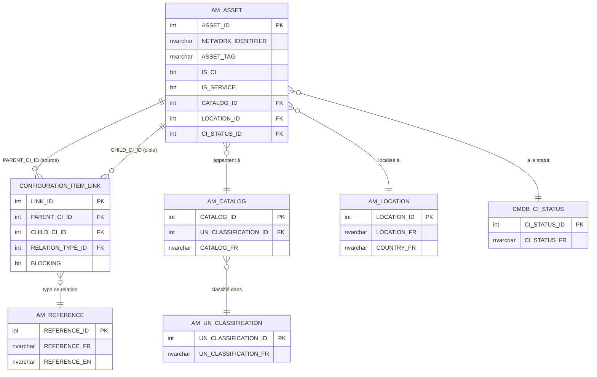

# Rapport Technique Complet — Graph Visualizer

> **Date :** 5 mars 2026  
> **Auteur :** GitHub Copilot (analyse automatique)  
> **Périmètre :** Architecture complète, base DATA_VALEO, algorithmes, optimisations

---

## Table des matières

1. [Vue d'ensemble du projet](#1-vue-densemble-du-projet)
2. [Architecture Backend](#2-architecture-backend)
3. [Architecture Frontend](#3-architecture-frontend)
4. [La base DATA_VALEO — Fonctionnement et structure](#4-la-base-data_valeo--fonctionnement-et-structure)
5. [Diagramme Mermaid de DATA_VALEO](#5-diagramme-mermaid-de-data_valeo)
6. [Ce qu'on apprend des fichiers SQL (01 à 15)](#6-ce-quon-apprend-des-fichiers-sql-01-à-15)
7. [Pistes d'amélioration et d'optimisation](#7-pistes-damélioration-et-doptimisation)
8. [Aspect algorithmique — Algorithmes à implémenter et tester](#8-aspect-algorithmique--algorithmes-à-implémenter-et-tester)

---

## 1. Vue d'ensemble du projet

### Qu'est-ce que c'est ?

Graph Visualizer est un **monorepo full-stack** permettant de visualiser et d'analyser des grands graphes de données (jusqu'à 50 000 nœuds testés). Il sert de couche de visualisation universelle au-dessus de n'importe quelle base de données orientée graphe — ou relationnelle modélisée en graphe.

Le cas d'usage principal est la **CMDB EasyVista de Valeo** : importer les Configuration Items (CI) et leurs relations depuis SQL Server, les transformer en graphe, puis les explorer visuellement pour faire de l'analyse d'impact, de la détection de clusters, ou de la simulation de pannes.

### Structure globale

```
node.js-graphe/
├── backend-nodejs/        # API Express + TypeScript (port 8080)
│   ├── src/
│   │   ├── index.ts       # Point d'entrée — enregistrement des moteurs
│   │   ├── routes/        # graphRoutes, databaseRoutes, cmdbRoutes
│   │   ├── services/      # Neo4j, Memgraph, MSSQL, ArangoDB, MermaidParser
│   │   ├── models/        # Interfaces TypeScript partagées
│   │   └── config/        # Dead code (legacy)
│   └── sql/               # 15 requêtes d'exploration DATA_VALEO
│
└── frontend-graph-viewer/ # React 18 + Vite (port 5173)
    └── src/
        ├── App.tsx        # Tout l'état global (hooks seulement)
        ├── components/    # 8 viewers indépendants
        ├── services/      # Client HTTP axios
        └── types/         # Types miroir du backend
```

### Flux de données principal

```
DATA_VALEO (SQL Server)
    └─► POST /api/cmdb/import-valeo
            └─► MssqlService.createGraph()
                    └─► graph_db (SQL Server)
                            └─► GET /api/graphs/:id
                                    └─► Frontend Viewer
```

---

## 2. Architecture Backend

### Le patron Strategy multi-moteur

Le cœur du backend repose sur une interface `GraphDatabaseService` implémentée par 4 moteurs :

| Moteur | Protocole | Technologie | Spécificité |
|--------|-----------|-------------|-------------|
| `Neo4jService` | Bolt 5.x | `neo4j-driver@5.28.3` | Multi-database, UNWIND batch 500 |
| `MemgraphService` | Bolt 4.x | `neo4j-driver@4.4.x` (alias npm) | Hérite Neo4j, remplace le driver, pas de multi-db |
| `MssqlService` | TCP/SQL | `mssql@12.2.0` | Tables relationnelles + CTE récursives |
| `ArangoService` | HTTP/AQL | `arangojs@10.2.2` | Collections documents + edge, batch 5000 |

Le moteur est sélectionné **par requête** via `?engine=neo4j|memgraph|mssql|arango`. Le middleware `resolveEngine` injecte l'instance sur `(req as any).dbService`. L'activation d'un moteur se fait par variable d'environnement (`NEO4J_URI`, `MEMGRAPH_URI`, `MSSQL_HOST`, `ARANGO_URL`).

### Les 13 méthodes de l'interface

```typescript
interface GraphDatabaseService {
  engineName: string
  initialize(): Promise<void>
  createGraph(graphId, title, desc, graphType, nodes[], edges[], database?): Promise<Graph>
  getGraph(graphId, database?, bypassCache?): Promise<GraphData>
  listGraphs(database?): Promise<GraphSummary[]>
  getGraphStats(graphId, database?): Promise<GraphStats>
  deleteGraph(graphId, database?): Promise<void>
  getStartingNode(graphId, database?): Promise<GraphNode | null>
  getNodeNeighbors(graphId, nodeId, depth, database?): Promise<GraphData>
  computeImpact(graphId, nodeId, depth, database?): Promise<ImpactResult>
  executeRawQuery?(query, database?): Promise<{rows, elapsed_ms, rowCount, engine}> // optionnel
  getCacheStats(): { hits, misses, bypasses, ... }
  clearCache(graphId?, database?): { cleared }
  listDatabases(): Promise<Array<{name, default, status}>>
  createDatabase(name): Promise<void>
  deleteDatabase(name): Promise<void>
  getDatabaseStats(name): Promise<{nodeCount, relationshipCount, graphCount}>
}
```

### Cache et performance

Tous les moteurs utilisent `NodeCache` (TTL 5 min, check 60s). La clé de cache est `graph:<database>:<graphId>`. Les réponses incluent systématiquement :

- `X-Cache: HIT|MISS|BYPASS`
- `X-Response-Time: Xms`
- `X-Engine: neo4j|mssql|...`
- `X-Parallel-Queries: true|false`
- `X-Content-Length-Raw: Nbytes`

### Contraintes par moteur

**Neo4j** : `properties` stockées en JSON.stringify. Depth interpolée dans la chaîne Cypher (non paramétrisée). Driver v5.28.3 obligatoire (v6 incompatible).

**Memgraph** : Remplace `this.driver` dans le constructeur parent par un driver v4 casté en `as any as Driver`. Override `computeImpact` : utilise `size(relationships(path))` car Memgraph n'a pas `length(path)`. Pas de multi-database.

**MSSQL** : Limit SQL Server 2100 paramètres → batch 500 nœuds / 400 arêtes. CTE récursives avec `MAXRECURSION 200`. Connection pools par database, initialisés lazy. La suppression d'un graphe repose sur `ON DELETE CASCADE`.

**ArangoDB** : `collection.import()` supporte 5000 éléments/batch. Les edge `_from`/`_to` sont des `_id` ArangoDB (ex: `graph_nodes/abc123`). Traversal natif `ANY v, e, p IN 1..N graph_edges`.

### Routes CMDB

`POST /api/cmdb/import-valeo` supporte 3 modes :
- **`default`** — sélection alphabétique avec filtre localisation
- **`connected`** — CIs triés par degré décroissant (les plus connectés en premier)
- **`cluster`** — Top N hubs par degré + tous leurs voisins directs + arêtes internes

Ce routeur crée ses propres `ConnectionPool` SQL Server par requête (ne réutilise pas les pools de `MssqlService`) car il cible d'autres bases (DATA_VALEO, EVO_DATA).

### Bugs connus

1. **MermaidParser** : le regex `-->|Label|` est vérifié après `-->`, la version labellisée ne sera jamais capturée (le regex générique matche en premier).
2. **Cache key dans graphRoutes.ts** : utilise `"neo4j"` comme fallback hardcodé au lieu de `service.engineName` → fausses statistiques cache pour les moteurs non-Neo4j.
3. **`config/database.ts`** : fichier mort (non importé), vestige de l'ancienne architecture mono-moteur.
4. **`zod`** : dépendance listée dans `package.json` mais jamais importée.
5. **`databaseRoutes.ts`** : utilise `console.error` au lieu de pino, alors que le reste utilise pino.

---

## 3. Architecture Frontend

### Les 8 viewers

```typescript
type ViewerType = 
  'force-graph'  // react-force-graph-2d — WebGL, layout physique
| '3d'           // react-force-graph-3d — Three.js, 3D navigable
| 'sigma'        // Sigma.js + ForceAtlas2 — mode progressif
| 'g6'           // AntV G6 — layout hiérarchique
| 'd3'           // D3.js — SVG, personnalisable
| 'cytoscape'    // Cytoscape.js — style tableur
| 'vis-network'  // vis-network — physique réaliste
| 'impact'       // ImpactAnalysis — BFS client vs serveur
```

Chaque viewer est autonome dans `src/components/`. Ils reçoivent tous `GraphData` brut sauf `GraphViewer` (force-graph 2D) qui reçoit un `ForceGraphData` pré-transformé.

### Rendu adaptatif par taille

Chaque viewer adapte son comportement selon `nodeCount` :

| Taille | Comportement |
|--------|-------------|
| < 500 | Labels visibles, physique active, rendu complet |
| 500–2k | Labels sur survol, physique réduite |
| 2k–5k | Labels désactivés, nœuds réduits |
| 5k–10k | Mode performance, WebGL préféré |
| > 10k | Progressive mode obligatoire (Sigma) |

### Mode progressif Sigma

Pour les graphes > 100 nœuds, Sigma commence **vide** avec un panneau liste (sidebar gauche). Un échantillon déterministe de 100 nœuds (Fisher-Yates seedé par `graphId`) est affiché. `exploreNode(nodeId)` ajoute un nœud + ses voisins directs + lance ForceAtlas2.

### Flux d'état dans App.tsx

```
Sélection moteur
    └─► loadDatabases()
            └─► selectedDatabase
                    └─► loadGraphs()
                                └─► selectedGraph
                                        └─► Viewer rendu
```

L'ordre des 3 `useEffect` est critique. Pas de librairie de state management (Redux, Zustand, etc.) — tout est `useState` + `useEffect` dans `App.tsx`.

### Communication inter-composants non standard

`OptimPanel` utilise `window.__optimSetLastLoad` (callback global sur window) pour communiquer avec `App`. C'est une solution de contournement pour éviter le prop drilling.

### Système de couleurs

Centralisé dans `graphTransform.ts` : 30+ `NODE_COLORS` nommés + fallback HSL déterministe (hash du `node_type`). `SigmaGraphViewer` mappe 250+ types de nœuds vers des icônes Iconify SVG.

---

## 4. La base DATA_VALEO — Fonctionnement et structure

### Contexte

DATA_VALEO est la **CMDB EasyVista de Valeo**, accessible via SQL Server, schéma `50004` dans la base `DATA_VALEO`. C'est une base de données de gestion des actifs IT (ITSM) contenant l'inventaire complet des équipements, services et applications du groupe Valeo, ainsi que leurs interdépendances.

### Tables principales

#### `AM_ASSET` — Table centrale des actifs IT
La table pivot. Contient tous les actifs : serveurs, applications, services, équipements réseau...

| Colonne | Type | Description |
|---------|------|-------------|
| `ASSET_ID` | INT | Clé primaire |
| `NETWORK_IDENTIFIER` | NVARCHAR | Nom de l'actif (ex: `SRV-PARIS-001`) |
| `ASSET_TAG` | NVARCHAR | Numéro de CI (référence CMDB) |
| `IS_CI` | BIT | 1 si c'est un Configuration Item géré |
| `IS_SERVICE` | BIT | 1 si c'est un service métier (vs infra physique) |
| `CATALOG_ID` | INT | FK → AM_CATALOG (type d'équipement) |
| `LOCATION_ID` | INT | FK → AM_LOCATION (site géographique) |
| `CI_STATUS_ID` | INT | FK → CMDB_CI_STATUS (cycle de vie) |

#### `CONFIGURATION_ITEM_LINK` — Les relations entre CIs (les arêtes du graphe)
C'est la table qui constitue le **graphe** : chaque ligne est une arête dirigée entre deux CIs.

| Colonne | Type | Description |
|---------|------|-------------|
| `LINK_ID` | INT | PK |
| `PARENT_CI_ID` | INT | FK → AM_ASSET (nœud source) |
| `CHILD_CI_ID` | INT | FK → AM_ASSET (nœud cible) |
| `RELATION_TYPE_ID` | INT | FK → AM_REFERENCE (type de relation) |
| `BLOCKING` | BIT | 1 si la relation est critique/bloquante |

#### `AM_CATALOG` — Catalogue des types d'équipements
Sert de pivot entre `AM_ASSET` et `AM_UN_CLASSIFICATION`.

| Colonne | Description |
|---------|-------------|
| `CATALOG_ID` | PK |
| `UN_CLASSIFICATION_ID` | FK → classification unifiée |

#### `AM_UN_CLASSIFICATION` — Catégorisation des CIs
Définit les grandes familles d'équipements : `Serveur`, `Application`, `Base de données`, `Équipement réseau`...

#### `AM_LOCATION` — Sites géographiques
Usines, datacenters, bureaux Valeo dans le monde. Colonne `LOCATION_FR` = nom en français.

#### `AM_REFERENCE` — Dictionnaire des types de relations
Contient les libellés des relations : `Hébergé sur`, `Dépend de`, `Contient`, `Connecté à`...

#### `CMDB_CI_STATUS` — Cycle de vie des CIs
Statuts : `Deployed` (production), `Retired` (décommissionné), `In test`, `Planned`...

### Modélisation graphe

```
AM_ASSET (IS_CI = 1)  →  Nœuds du graphe
CONFIGURATION_ITEM_LINK  →  Arêtes du graphe
AM_UN_CLASSIFICATION  →  node_type
AM_LOCATION  →  propriété géographique
BLOCKING = 1  →  arêtes critiques (sous-graphe d'impact)
```

### Volumétrie estimée (d'après les requêtes SQL)

Les requêtes analysent des tailles de sous-graphes simulés (fichier 11) :

| Filtre | Nœuds (approx) | Arêtes internes (approx) |
|--------|----------------|--------------------------|
| Top 100 CIs connectés | 100 | ~10K–50K |
| Top 1 000 CIs | 1 000 | très dense |
| Top 5 000 CIs | 5 000 | scalabilité limite |
| Tous les CIs | >50 000 | >>100 000 |

Le graphe complet DATA_VALEO est vraisemblablement un **graphe de type scale-free** (distribution des degrés en loi de puissance) : peu de hubs ultra-connectés (~500+ arêtes chacun), la majorité des nœuds ayant 1–5 connexions.

---

## 5. Diagramme Mermaid de DATA_VALEO



### Flux de l'import CMDB → graphe

```mermaid
flowchart TD
    A[DATA_VALEO SQL Server\nschéma 50004] -->|JOIN AM_ASSET + AM_CATALOG\n+ AM_UN_CLASSIFICATION| B[Requête SQL\ncmdbRoutes.ts]
    B -->|mode=default / connected / cluster| C{Sélection\ndu sous-graphe}
    C -->|Nœuds filtrés\nnodes\[\]| D[MssqlService\ncreateGraph]
    C -->|Arêtes via\nCONFIGURATION_ITEM_LINK| D
    D -->|INSERT batch\n500 nœuds / 400 arêtes| E[(graph_db\ngraph_nodes\ngraph_edges)]
    E -->|GET /api/graphs/:id| F[Frontend]
    F --> G[ForceGraph 2D]
    F --> H[Sigma Progressif]
    F --> I[Impact Analysis]
```

---

## 6. Ce qu'on apprend des fichiers SQL (01 à 15)

### `01_overview.sql` — Comptages globaux

Fournit les métriques de base de la CMDB en une seule requête scalaire : total assets, total CIs (`IS_CI=1`), services vs non-services, total liens, localisations, catalogues, classifications. C'est le **point d'entrée** pour calibrer la taille du graphe avant tout import.

### `02_categories.sql` — Distribution par catégorie

Requête `TOP 40` groupée sur `AM_UN_CLASSIFICATION.UN_CLASSIFICATION_FR`. Révèle quelles catégories dominent en nombre de CIs (typiquement Serveurs physiques, VMs, Applications, Équipements réseau). Permet de choisir les **filtres de catégorie** pour les imports partiels.

### `03_relation_types.sql` — Types de relations

Classement des types de liens par fréquence + comptage des relations bloquantes par type. Crucial pour comprendre la **sémantique du graphe** : `Hébergé sur`, `Dépend de`, `Connecté à` n'ont pas la même signification pour l'analyse d'impact.

### `04_edge_density_by_category.sql` — Densité par catégorie

Pour chaque catégorie, compte les CIs **et** les arêtes dont ils sont parents. Identifie les catégories qui forment les sous-graphes les plus denses — cibles prioritaires pour les tests de performance.

### `05_top_connected_nodes.sql` — Top 50 hubs

Les nœuds avec le plus d'arêtes (in + out). Ces **hubs** sont les plus importants pour l'analyse d'impact (une panne sur un hub affecte le plus grand nombre de CIs) et les plus intéressants comme points de départ pour BFS/DFS.

### `06_subgraph_by_category_pair.sql` — Connexions entre catégories

Agrégation des liens par paire de catégories (parent-catégorie, child-catégorie). Révèle la structure **méso** du graphe : ex. `Application → Serveur` est probablement la paire la plus fréquente.

### `07_subgraph_by_location.sql` (fichier ouvert actuellement)

Densité de graphe par site géographique : nombre de CIs et arêtes **internes** (PARENT et CHILD dans le même site). Filtre `HAVING COUNT >= 100` pour ne garder que les sites significatifs. Utile pour créer des sous-graphes par datacenter ou usine.

### `08_dense_clusters.sql` — Recherche de clusters

Identifie le cluster autour des top-10 hubs : tous leurs voisins directs + les arêtes internes à ce voisinage. Mesure la densité du cluster (ratio arêtes/nœuds). Correspond à l'opération `mode=cluster` de l'API CMDB.

### `09_edge_vs_node_ratios.sql` — Ratios densité

Compare trois populations : services uniquement, non-services uniquement, mixte. Aide à choisir quel sous-ensemble importer pour des benchmarks équilibrés.

### `10_degree_distribution.sql` — Distribution des degrés

Histogramme par tranches : 0 arête (isolés), 1–5, 6–20, 21–100, 101–500, 501–1000, 1000+. Met en évidence la **loi de puissance** caractéristique des graphes CMDB. Les nœuds isolés (~30–40% selon les estimations) sont filtrés implicitement par les imports mode connected/cluster.

### `11_subgraph_simulations.sql` — Simulation sous-graphes

Mesure le nombre d'arêtes internes pour différents N (top-100, 500, 1000, 2000, 5000, 10000 CIs). Permet de **calibrer** les imports : à partir de quel N la densité explose-t-elle pour le rendu frontend ?

### `12_blocking_relations.sql` — Relations bloquantes

Sous-graphe critique : uniquement les liens avec `BLOCKING=1`. Identifie les CIs les plus impactants (parents bloquants avec le plus d'enfants). C'est le vrai graphe d'impact opérationnel en cas de panne.

### `13_ci_status_subgraphs.sql` — Par statut de cycle de vie

Filtre le graphe par statut (`Deployed`, `Retired`, `In test`). Un graphe des `Deployed` uniquement est le graphe de production réelle — plus pertinent pour l'analyse d'impact que l'ensemble de la CMDB.

### `14_service_dependency_graph.sql` — Graphe des services métier

Focus sur `IS_SERVICE=1` : services → services (couche applicative), services → infra (couche d'hébergement). Vue de haut niveau pour la cartographie métier.

### `15_bfs_from_hub.sql` — BFS SQL natif

Simule un BFS depuis le CI le plus connecté (profondeur 1 : voisins directs). Mesure les nœuds atteignables et les arêtes dans le sous-graphe. Montre les limites du BFS en SQL pur (uniquement profondeur 1 ici, CTE récursives nécessaires pour aller plus loin).

---

## 7. Pistes d'amélioration et d'optimisation

### 7.1 Backend — Corrections de bugs prioritaires

**Bug 1 — Cache key incorrecte dans `graphRoutes.ts`**
```typescript
// Actuel (faux pour MSSQL, Arango, Memgraph)
const cacheKey = `graph:neo4j:${graphId}`;
// Correct
const cacheKey = `graph:${service.engineName}:${database ?? 'default'}:${graphId}`;
```

**Bug 2 — MermaidParser : regex labelled edge**
```typescript
// Réordonner pour tester le pattern spécifique en premier
const EDGE_WITH_LABEL = /(\w+)\s*-->\|([^|]+)\|\s*(\w+)/; // tester EN PREMIER
const EDGE_PLAIN     = /(\w+)\s*--+>\s*(\w+)/;            // puis le générique
```

**Bug 3 — `databaseRoutes.ts` utilise `console.error` à la place de pino** — uniformiser avec `req.log.error` ou importer `logger`.

### 7.2 Backend — Performances

**Cache distribué Redis** : actuellement le cache `NodeCache` est en mémoire et perdu à chaque redémarrage. Pour un environnement multi-instance, migrer vers Redis (`ioredis`) avec le même TTL 5 min. Gain : persistance cache inter-déploiements.

**Index SQL Server manquants** : dans `MssqlService.ensureTables()`, ajouter des index couvrants pour les requêtes les plus fréquentes :
```sql
CREATE INDEX IX_graph_nodes_type ON graph_nodes (graph_id, node_type);
CREATE INDEX IX_graph_edges_covering ON graph_edges (graph_id, source_id, target_id) INCLUDE (edge_type, label);
```

**Pool CMDB dédié** : `cmdbRoutes.ts` crée un nouveau `ConnectionPool` par requête. Extraire en singleton initialisé au démarrage pour chaque base CMDB (DATA_VALEO, EVO_DATA).

**Pagination des grands graphes** : `GET /api/graphs/:id` renvoie tout le graphe en une fois. Pour >10K nœuds, ajouter `?page=&pageSize=` ou un streaming NDJSON.

**Compression sélective** : le gzip niveau 6 est actif sur tous les endpoints. Pour les WebSocket et le cache-hit, désactiver la compression (déjà compressé en cache).

### 7.3 Frontend — Performances

**Virtualisation de la liste Sigma** : le panneau liste de nœuds de `SigmaGraphViewer` rend tous les items D'un coup. Pour >5000 nœuds, utiliser `react-virtual` ou `react-window`.

**Web Workers pour les layouts** : ForceAtlas2 et le BFS client (`ImpactAnalysis`) bloquent le thread principal. Les déplacer dans un Worker avec `comlink` :
```typescript
// src/workers/forceAtlas2.worker.ts
import { expose } from 'comlink';
const worker = { runLayout: (graph) => { /* FA2 */ } };
expose(worker);
```

**Code splitting par viewer** : importer chaque viewer en `React.lazy()` pour ne charger Three.js, Cytoscape, etc. que si l'utilisateur les sélectionne. Gain estimé : -60% du bundle initial.

**Mémorisation des transformations** : `graphTransform.ts` recalcule les transformations à chaque render. Wrapper dans `useMemo` avec `graphId` comme dépendance.

### 7.4 Architecture — Évolutions structurelles

**Tests unitaires** : `package.json` a un script `test: echo "no tests"`. Ajouter `vitest` avec au minimum :
- Tests unitaires de `MermaidParser` (les regex bugs auraient été catchés)
- Tests d'intégration MSSQL avec une base SQLite en mémoire via `better-sqlite3`
- Tests des transformations `graphTransform.ts`

**Typage strict de `resolveEngine`** : remplacer `(req as any).dbService` par une interface Express étendue :
```typescript
// src/types/express.d.ts
declare namespace Express {
  interface Request { dbService: GraphDatabaseService }
}
```

**Suppression du code mort** : `src/config/database.ts` et la dépendance `zod` peuvent être supprimés sans impact.

**Variables d'environnement typées** : utiliser `zod` (déjà installé !) pour valider le `.env` au démarrage :
```typescript
const envSchema = z.object({
  NEO4J_URI: z.string().url().optional(),
  MSSQL_HOST: z.string().optional(),
  // ...
});
```

### 7.5 CMDB — Import et modélisation

**Import incrémental** : actuellement un import crée un nouveau graphe complet. Ajouter `PUT /api/cmdb/import-valeo/:graphId` pour des mises à jour différentielles (nouveaux CIs, nouvelles relations).

**Métadonnées enrichies** : lors de l'import, ajouter dans `node.properties` :
- `location` (nom du site)
- `ci_status` (Deployed / Retired)
- `is_service` (boolean)
- `blocking_edge_count` (pré-calculé)

**Graphe de statut** : importer uniquement `IS_CI=1 AND CI_STATUS='Deployed'` pour le graphe de production. Évite de visualiser des CIs décommissionnés qui faussent l'analyse d'impact.

---

## 8. Aspect algorithmique — Algorithmes à implémenter et tester

Le projet dispose déjà d'un BFS serveur (`computeImpact`) et d'un BFS client (graphology dans `ImpactAnalysis`). Il manque une suite d'algorithmes pour explorer en profondeur les propriétés du graphe DATA_VALEO.

### 8.1 Algorithmes de parcours

| # | Algorithme | Objectif dans DATA_VALEO | Complexité |
|---|------------|--------------------------|------------|
| 1 | **BFS (déjà présent)** | Propagation d'impact depuis un CI | $O(V + E)$ |
| 2 | **DFS** | Détecter les cycles de dépendances | $O(V + E)$ |
| 3 | **BFS bidirectionnel** | Chemin le plus court entre 2 CIs | $O(b^{d/2})$ |
| 4 | **Dijkstra** | Chemin critique pondéré (poids = criticité) | $O((V+E)\log V)$ |
| 5 | **A\*** | Chemin optimal avec heuristique géographique | $O(E)$ best case |

**Comment les tester dans le projet** : ajouter `POST /api/graphs/:id/traverse` avec body `{algorithm, sourceNode, targetNode?, depth?, weights?}`. Comparer `elapsed_ms` entre chaque algorithme sur le même graphe.

### 8.2 Algorithmes de centralité

Ces algorithmes identifient les nœuds les plus "importants" dans le graphe — directement applicable pour trouver les CIs critiques dans DATA_VALEO.

| # | Algorithme | Interprétation CMDB | Complexité |
|---|------------|---------------------|------------|
| 6 | **Degree Centrality** | CIs avec le plus de connexions | $O(V + E)$ |
| 7 | **Betweenness Centrality** | CIs sur le plus grand nombre de chemins critiques | $O(VE)$ |
| 8 | **Closeness Centrality** | CIs atteignant le plus vite tous les autres | $O(V(V+E))$ |
| 9 | **PageRank** | Importance récursive (un CI connecté à des hubs = plus important) | $O(kE)$ itératif |
| 10 | **Eigenvector Centrality** | Variante PageRank non normalisée | $O(kn^2)$ |
| 11 | **HITS (Hubs & Authorities)** | Distinguer les CIs orchestrateurs des CIs feuilles | $O(kE)$ |

**Implémentation recommandée** : utiliser `graphology-metrics` (déjà dans les dépendances frontend via graphology) + implementer les mêmes côté backend avec des CTE SQL récursives pour MSSQL.

### 8.3 Algorithmes de détection de communautés / clusters

| # | Algorithme | Utilité | Notes |
|---|------------|---------|-------|
| 12 | **Louvain** | Découverte automatique des clusters de CIs | Référence pour CMDB |
| 13 | **Label Propagation** | Rapide pour grands graphes | $O(E)$ par itération |
| 14 | **Girvan-Newman** | Détection par suppression d'arêtes (betweenness) | Lent, $O(V \cdot E^2)$ |
| 15 | **Strongly Connected Components (Kosaraju/Tarjan)** | Cycles de dépendances = SCC | $O(V + E)$ |
| 16 | **Weakly Connected Components** | Partitionner les CIs isolés des hubs | $O(V + E)$ (Union-Find) |

**Pour DATA_VALEO** : Louvain est l'algorithme de référence. Il devrait naturellement grouper par catégorie (Serveurs ensemble, Applications ensemble...) ou par localisation géographique.

### 8.4 Algorithmes de chemins critiques

| # | Algorithme | Application CMDB |
|---|------------|-----------------|
| 17 | **Critical Path Method (CPM)** | Séquence de dépendances la plus longue → délai de remédiation max |
| 18 | **Floyd-Warshall** | Matrice complète des plus courts chemins (pour petits sous-graphes) |
| 19 | **Bellman-Ford** | Chemins avec poids négatifs (ex: priorité inverse) |
| 20 | **DAG topological sort** | Ordre de déploiement d'un service |

### 8.5 Algorithmes de résilience / analyse de pannes

| # | Algorithme | Application |
|---|------------|-------------|
| 21 | **Vertex Connectivity** | Nombre minimum de CIs à supprimer pour déconnecter le graphe |
| 22 | **Edge Connectivity (Karger, max-flow min-cut)** | Relations critiques dont la suppression isole un cluster |
| 23 | **Cascading Failure Simulation** | Simuler la propagation d'une panne en supprimant itérativement les nœuds impactés |
| 24 | **Percolation Analysis** | À partir de quel % de CIs tombés le service global est-il impacté ? |

### 8.6 Plan d'implémentation suggéré

#### Phase 1 — Centralité (2 semaines)
Ajouter `POST /api/graphs/:id/centrality` avec `?algorithm=pagerank|degree|betweenness`.

```typescript
// Exemple d'endpoint
router.post('/graphs/:id/centrality', async (req, res) => {
  const { algorithm = 'pagerank', iterations = 20 } = req.body;
  const graph = await service.getGraph(req.params.id);
  // Construire graphology Graph en mémoire
  // Appliquer l'algorithme via graphology-metrics ou implémentation custom
  // Retourner { nodeId, score }[] trié DESC
});
```

#### Phase 2 — Détection de communautés (3 semaines)
Ajouter `POST /api/graphs/:id/communities` avec `?algorithm=louvain|label-propagation`.
Stocker les communautés dans `node.properties.community_id` pour colorisation frontend.

#### Phase 3 — Simulation de pannes (4 semaines)
Endpoint `POST /api/graphs/:id/simulate-failure` avec body `{nodeIds[], mode: 'cascade'|'singleFailure'}`.
Utilise le graphe bloquant (`BLOCKING=1`) comme sous-graphe de propagation.

#### Phase 4 — Benchmark comparatif
Tableau de bord comparant les temps d'exécution des algorithmes selon :
- Le moteur (Neo4j natif `gds.*` vs SQL CTE vs implémentation JS graphology)
- La taille du graphe (1K, 5K, 10K, 50K nœuds)
- La profondeur de traversal (1, 3, 5, 10)

### 8.7 Algorithmes disponibles nativement par moteur

| Algorithme | Neo4j GDS | Memgraph MAGE | MSSQL (CTE) | ArangoDB (AQL) |
|------------|-----------|---------------|-------------|----------------|
| BFS / DFS | ✅ | ✅ | ✅ (MAXRECURSION) | ✅ |
| Dijkstra | ✅ `gds.shortestPath.dijkstra` | ✅ | ⚠️ (manuel, lent) | ✅ `GRAPH_SHORTEST_PATH` |
| PageRank | ✅ `gds.pageRank` | ✅ `pagerank()` | ❌ | ✅ `GRAPH_PAGERANK` |
| Louvain | ✅ `gds.louvain` | ✅ | ❌ | ❌ |
| Betweenness | ✅ `gds.betweenness` | ✅ | ❌ | ❌ |
| SCC Tarjan | ✅ `gds.scc` | ✅ | ⚠️ (CTE, partiel) | ❌ |

**Recommandation** : utiliser **Neo4j GDS** (Graph Data Science library) pour les algorithmes avancés côté serveur, et **graphology** pour les algorithmes légers côté client (degré, BFS, composantes connexes). Exposer les algorithmes GDS via l'endpoint `executeRawQuery` déjà en place.

---

## Annexe — Dépendances clés

### Backend
| Package | Version | Rôle |
|---------|---------|------|
| `tsx` | latest | Runner TypeScript ESM sans build |
| `neo4j-driver` | 5.28.3 | Client Neo4j (bolt 5.x) |
| `neo4j-driver-memgraph` | alias 4.4.x | Client Memgraph (bolt 4.x) |
| `mssql` | 12.2.0 | Client SQL Server |
| `arangojs` | 10.2.2 | Client ArangoDB |
| `node-cache` | 5.1.2 | Cache TTL en mémoire |
| `ws` | 8.19.x | WebSocket serveur |
| `pino` | latest | Logging structuré JSON |
| `compression` | latest | Gzip middleware |

### Frontend
| Package | Rôle |
|---------|------|
| `react-force-graph` | WebGL 2D physique |
| `react-force-graph-3d` | Three.js 3D |
| `sigma` + `graphology` | Sigma.js + graphologie |
| `@antv/g6` | Layout hiérarchique |
| `d3` | SVG custom |
| `cytoscape` | Style feuille de calcul |
| `vis-network` | Physique réaliste |
| `axios` | Client HTTP |
| `@iconify/react` | 250+ icônes SVG pour types de nœuds |

---

*Rapport généré automatiquement par analyse statique du code source — Graph Visualizer, mars 2026.*
