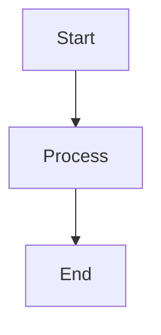
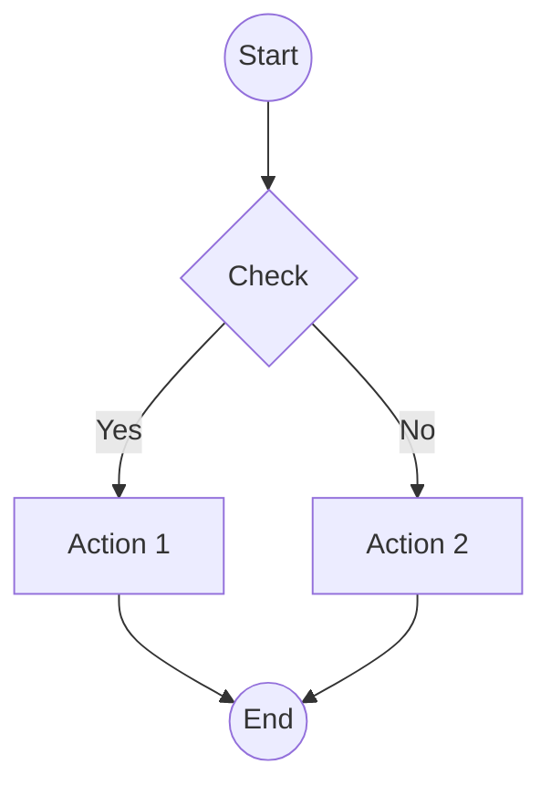
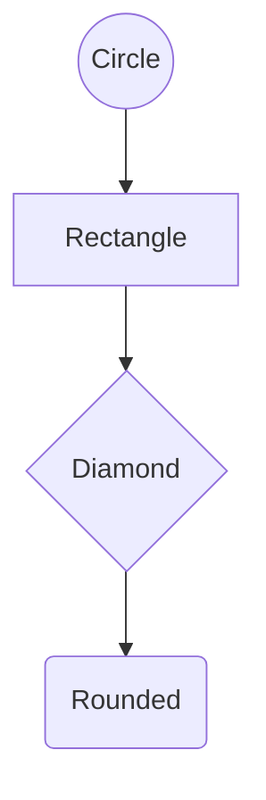
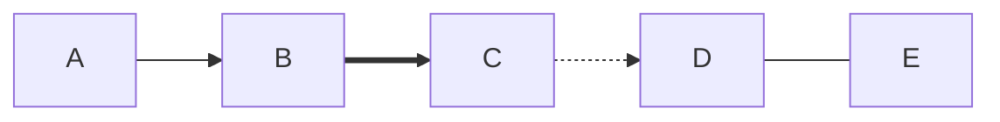
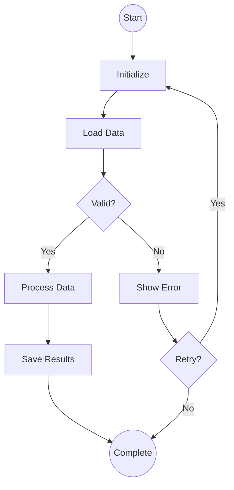

# Exemples d'utilisation de l'API Graph Visualizer

## Installation et Démarrage

```bash
# Installer les dépendances
npm install

# Démarrer le serveur
npm run dev
```

Le serveur démarre sur `http://127.0.0.1:8080`

---

## 📡 Exemples de Requêtes

### 1. Health Check

```bash
curl http://127.0.0.1:8080/api/health
```

**Réponse:**
```json
{
  "status": "ok",
  "timestamp": "2026-02-11T12:34:56.789Z"
}
```

---

### 2. Lister tous les graphes

```bash
curl http://127.0.0.1:8080/api/graphs
```

**Réponse:**
```json
[
  {
    "id": "example",
    "title": "Example Workflow",
    "description": "A demonstration workflow",
    "graph_type": "flowchart",
    "node_count": 11,
    "edge_count": 14
  },
  {
    "id": "xlarge_test",
    "title": "Extra Large Dense Test Graph",
    "description": "An extra large dense test graph with 20,000 nodes and 3-10 edges per node",
    "graph_type": "network",
    "node_count": 20000,
    "edge_count": 140000
  }
]
```

---

### 3. Obtenir un graphe spécifique

```bash
curl http://127.0.0.1:8080/api/graphs/example
```

**Réponse:**
```json
{
  "nodes": [
    {
      "id": "A",
      "label": "Start",
      "node_type": "start",
      "properties": {}
    },
    {
      "id": "B",
      "label": "Process 1",
      "node_type": "process",
      "properties": {}
    }
  ],
  "edges": [
    {
      "id": "123456",
      "source": "A",
      "target": "B",
      "label": "Start",
      "edge_type": "next",
      "properties": {}
    }
  ]
}
```

---

### 4. Obtenir les statistiques d'un graphe

```bash
curl http://127.0.0.1:8080/api/graphs/example/stats
```

**Réponse:**
```json
{
  "node_count": 11,
  "edge_count": 14,
  "node_types": {
    "start": 1,
    "process": 7,
    "decision": 1,
    "end": 1,
    "error": 1
  },
  "average_degree": 1.27
}
```

---

### 5. Créer un nouveau graphe - Simple

```bash
curl -X POST http://127.0.0.1:8080/api/graphs \
  -H "Content-Type: application/json" \
  -d '{
    "title": "Simple Workflow",
    "description": "A simple 3-step workflow",
    "graph_type": "flowchart",
    "mermaid_code": "graph TD\nA[Start] --> B[Process]\nB --> C[End]"
  }'
```

**Réponse:**
```json
{
  "id": "graph_1707652496789_abc123xyz",
  "title": "Simple Workflow",
  "description": "A simple 3-step workflow",
  "graph_type": "flowchart",
  "node_count": 3,
  "edge_count": 2,
  "created_at": "2026-02-11T12:34:56.789Z"
}
```

---

### 6. Créer un graphe complexe avec décisions

```bash
curl -X POST http://127.0.0.1:8080/api/graphs \
  -H "Content-Type: application/json" \
  -d '{
    "title": "Order Processing",
    "description": "E-commerce order processing workflow",
    "graph_type": "flowchart",
    "mermaid_code": "graph TD\nA((Start)) --> B[Validate Order]\nB --> C{Valid?}\nC -->|Yes| D[Process Payment]\nC -->|No| E[Reject Order]\nD --> F{Payment OK?}\nF -->|Yes| G[Ship Order]\nF -->|No| E\nG --> H((Complete))\nE --> I((End))"
  }'
```

---

### 7. Créer un graphe avec différents types de connexions

```bash
curl -X POST http://127.0.0.1:8080/api/graphs \
  -H "Content-Type: application/json" \
  -d '{
    "title": "Connection Types Demo",
    "description": "Demonstrates different connection types",
    "graph_type": "flowchart",
    "mermaid_code": "graph TD\nA[Start] --> B[Main Flow]\nB ==> C[Important Step]\nC -.-> D[Optional Step]\nD --- E[Related Info]\nE --> F[End]"
  }'
```

---

### 8. Créer un graphe avec labels sur les arêtes

```bash
curl -X POST http://127.0.0.1:8080/api/graphs \
  -H "Content-Type: application/json" \
  -d '{
    "title": "Labeled Edges",
    "description": "Graph with labeled connections",
    "graph_type": "flowchart",
    "mermaid_code": "graph TD\nA[Login] -->|Success| B[Dashboard]\nA -->|Failure| C[Error Page]\nB -->|Logout| D[Goodbye]\nC -->|Retry| A"
  }'
```

---

### 9. Supprimer un graphe

```bash
curl -X DELETE http://127.0.0.1:8080/api/graphs/graph_1707652496789_abc123xyz
```

**Réponse:** 204 No Content

---

## 🧪 Tests avec PowerShell

### Lister les graphes

```powershell
Invoke-RestMethod -Uri "http://127.0.0.1:8080/api/graphs" -Method GET
```

### Créer un graphe

```powershell
$body = @{
    title = "Test Graph"
    description = "Created from PowerShell"
    graph_type = "flowchart"
    mermaid_code = "graph TD`nA[Start] --> B[End]"
} | ConvertTo-Json

Invoke-RestMethod -Uri "http://127.0.0.1:8080/api/graphs" `
  -Method POST `
  -ContentType "application/json" `
  -Body $body
```

### Obtenir un graphe

```powershell
Invoke-RestMethod -Uri "http://127.0.0.1:8080/api/graphs/example" -Method GET
```

---

## 📝 Exemples de Code Mermaid Supportés

### 1. Flowchart Simple



### 2. Avec Décisions



### 3. Différents Types de Nœuds



### 4. Différents Types de Connexions



### 5. Workflow Complexe



---

## 🔍 Débogage

### Activer le mode debug

Modifier `.env`:
```env
LOG_LEVEL=debug
```

### Voir les logs en temps réel

```bash
npm run dev
```

Les logs sont au format JSON structuré avec `pino`.

---

## 📝 Note sur Neo4j

Le backend utilise Neo4j comme base de données de graphes native. Les graphes sont stockés avec :

- **Nœuds** : Labels `Graph` et `GraphNode`
- **Relations** : Type `CONNECTED_TO`
- **Requêtes** : Langage Cypher

Vous pouvez visualiser les graphes directement dans Neo4j Browser à l'adresse `http://localhost:7474`
