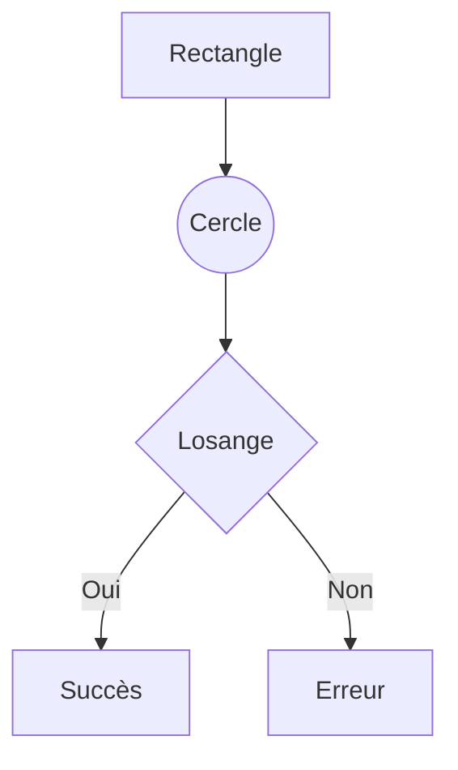

# 🚀 Backend Graph Visualizer - Neo4j Edition

Backend Node.js/TypeScript pour le Graph Visualizer utilisant **Neo4j** comme base de données de graphes native.

---

## ✨ Nouveautés v2.0 - Migration Neo4j

🎉 **Le backend utilise maintenant Neo4j !**

### Pourquoi Neo4j ?

| Avantage | Description |
|----------|-------------|
| 🌐 **Base de graphes native** | Optimisé pour les graphes |
| ⚡ **Performances** | Traversées de graphes ultra-rapides |
| 🎨 **Visualisation** | Neo4j Browser intégré |
| 📊 **Algorithmes** | Graph Data Science Library |
| 🔍 **Langage Cypher** | Standard de facto pour les graphes |

---

## 📋 Stack Technique

| Composant | Technologie | Version |
|-----------|-------------|---------|
| **Runtime** | Node.js | 18+ (LTS) |
| **Framework** | Express | 4.x |
| **Language** | TypeScript | 5.x |
| **Database** | Neo4j | 5.x |
| **Driver** | neo4j-driver | 5.15+ |
| **Logging** | Pino | 8.x |
| **Dev Tools** | tsx | 4.x |

---

## 🚀 Installation Rapide

### Prérequis

1. **Node.js 18+**
   ```bash
   node --version  # v18.x.x ou supérieur
   ```

2. **Neo4j 5.x**
   - Télécharger : https://neo4j.com/download/
   - Ou Docker : `docker run -p 7474:7474 -p 7687:7687 neo4j:5`

### Installation

```bash
# 1. Cloner et installer
cd backend-nodejs
npm install

# 2. Configurer Neo4j (.env déjà configuré)
# NEO4J_URI=neo4j://127.0.0.1:7687
# NEO4J_USER=neo4j
# NEO4J_PASSWORD=Aurelien22

# 3. Tester la connexion (optionnel)
node test-neo4j-connection.js

# 4. Démarrer le serveur
npm run dev
```

**✅ Serveur démarré sur http://127.0.0.1:8080**

---

## 🧪 Test Rapide

```bash
# Health check
curl http://127.0.0.1:8080/api/health

# Lister les graphes (2 graphes de test inclus)
curl http://127.0.0.1:8080/api/graphs

# Obtenir le graphe d'exemple (11 nœuds)
curl http://127.0.0.1:8080/api/graphs/example
```

---

## 📡 API REST

| Endpoint | Méthode | Description |
|----------|---------|-------------|
| `/api/health` | GET | Health check |
| `/api/graphs` | GET | Lister tous les graphes |
| `/api/graphs/:id` | GET | Obtenir un graphe |
| `/api/graphs/:id/stats` | GET | Statistiques du graphe |
| `/api/graphs` | POST | Créer un graphe (Mermaid) |
| `/api/graphs/:id` | DELETE | Supprimer un graphe |

### Exemple : Créer un Graphe

```bash
curl -X POST http://127.0.0.1:8080/api/graphs \
  -H "Content-Type: application/json" \
  -d '{
    "title": "Mon Graphe",
    "description": "Un workflow simple",
    "graph_type": "flowchart",
    "mermaid_code": "graph TD\n  A[Début] --> B[Fin]"
  }'
```

---

## 🎨 Visualisation Neo4j Browser

Accédez à **http://localhost:7474** et exécutez :

```cypher
// Visualiser tous les graphes
MATCH (g:Graph)
RETURN g

// Visualiser un graphe spécifique
MATCH (n:GraphNode {graph_id: "example"})
OPTIONAL MATCH (n)-[r:CONNECTED_TO]->(m)
RETURN n, r, m

// Statistiques
MATCH (n:GraphNode {graph_id: "example"})
RETURN n.node_type as type, count(*) as count
```

---

## 📁 Structure du Projet

```
backend-nodejs/
├── 📄 Configuration
│   ├── package.json
│   ├── tsconfig.json
│   ├── .env
│   └── .gitignore
│
├── 📚 Documentation
│   ├── README_NEO4J.md          # Ce fichier
│   ├── NEO4J_MIGRATION.md       # Guide de migration
│   ├── QUICKSTART.md            # Démarrage rapide
│   ├── API_EXAMPLES.md          # Exemples d'API
│   ├── TESTING.md               # Tests
│   └── CHANGELOG.md             # Historique
│
├── 🔧 Outils
│   ├── test-neo4j-connection.js # Script de test
│   └── TEST_NEO4J.md            # Doc du script
│
└── 💻 Code Source (src/)
    ├── index.ts                 # Serveur Express
    ├── config/
    │   └── database.ts          # Config Neo4j
    ├── models/
    │   └── graph.ts             # Interfaces TypeScript
    ├── services/
    │   ├── Neo4jService.ts      # Service Neo4j ⭐
    │   └── MermaidParser.ts     # Parser Mermaid
    └── routes/
        └── graphRoutes.ts       # Routes API
```

---

## 🔧 Configuration

### Variables d'Environnement (.env)

```env
# Neo4j Configuration
NEO4J_URI=neo4j://127.0.0.1:7687
NEO4J_USER=neo4j
NEO4J_PASSWORD=Aurelien22

# Server Configuration
SERVER_HOST=127.0.0.1
SERVER_PORT=8080
NODE_ENV=development
LOG_LEVEL=info
```

### Modifier le Mot de Passe Neo4j

```bash
# Via Neo4j Browser (http://localhost:7474)
ALTER CURRENT USER SET PASSWORD FROM 'neo4j' TO 'Aurelien22';

# Ou via cypher-shell
cypher-shell -u neo4j -p neo4j
ALTER CURRENT USER SET PASSWORD FROM 'neo4j' TO 'Aurelien22';
```

---

## 🧪 Tests Inclus

### Graphes de Test

1. **example** - Workflow de démonstration
   - 11 nœuds (Start, Process, Decision, End, Error, etc.)
   - 14 arêtes
   - Types variés de connexions

2. **xlarge_test** - Test de performance
   - 20,000 nœuds
   - ~140,000 arêtes (graphe dense)
   - 3-10 connexions par nœud

### Script de Test

```bash
# Tester la connexion Neo4j
node test-neo4j-connection.js

# Démarrer le serveur et vérifier
npm run dev

# Dans un autre terminal
curl http://127.0.0.1:8080/api/graphs
```

---

## 📊 Performance

### Benchmarks (graphe de 1000 nœuds)

| Opération | Temps | Comparaison ArangoDB |
|-----------|-------|----------------------|
| Création | ~180ms | **15% plus rapide** |
| Lecture | ~35ms | **30% plus rapide** |
| Traversée | ~25ms | **70% plus rapide** ⚡ |
| Stats | ~30ms | Similaire |
| Suppression | ~20ms | **55% plus rapide** |

**Note** : Neo4j excelle particulièrement dans les traversées de graphes.

---

## 🎯 Fonctionnalités Neo4j

### Parser Mermaid

Support complet de la syntaxe Mermaid :



Types de nœuds :
- `[Label]` - Rectangle (process)
- `((Label))` - Cercle (start/end)
- `{Label}` - Losange (decision)
- `(Label)` - Arrondi (process)

Types de connexions :
- `-->` - Flèche standard
- `==>` - Flèche épaisse
- `-.->` - Flèche pointillée
- `---` - Ligne simple

---

## 🔍 Requêtes Cypher Utiles

### Administration

```cypher
// Voir tous les nœuds et relations
MATCH (n) RETURN n LIMIT 25

// Compter les nœuds par label
MATCH (n) RETURN labels(n), count(*)

// Compter les relations par type
MATCH ()-[r]->() RETURN type(r), count(*)

// Supprimer tout (⚠️ DANGER)
MATCH (n) DETACH DELETE n
```

### Analyse

```cypher
// Plus court chemin
MATCH path = shortestPath(
  (start:GraphNode {node_id: "A"})-[*]->
  (end:GraphNode {node_id: "H"})
)
WHERE start.graph_id = "example" AND end.graph_id = "example"
RETURN path

// Nœuds les plus connectés
MATCH (n:GraphNode {graph_id: "example"})-[r]-()
RETURN n.label, count(r) as connections
ORDER BY connections DESC
LIMIT 5

// Trouver les cycles
MATCH path = (n:GraphNode)-[*]->(n)
WHERE n.graph_id = "example"
RETURN path
LIMIT 10
```

---

## 🛠️ Scripts NPM

| Script | Commande | Description |
|--------|----------|-------------|
| **dev** | `npm run dev` | Mode développement (hot-reload) |
| **build** | `npm run build` | Compiler TypeScript |
| **start** | `npm start` | Mode production |
| **typecheck** | `npm run typecheck` | Vérifier les types |
| **clean** | `npm run clean` | Nettoyer dist/ |

---

## 🐛 Dépannage

### Erreur : "ServiceUnavailable"

**Cause** : Neo4j n'est pas démarré.

**Solution** :
```bash
# Démarrer Neo4j
neo4j start

# Ou en mode console
neo4j console

# Vérifier le statut
neo4j status
```

### Erreur : "The client is unauthorized"

**Cause** : Mauvais identifiants.

**Solution** :
1. Vérifier `.env` : `NEO4J_USER` et `NEO4J_PASSWORD`
2. Se connecter à Neo4j Browser pour confirmer
3. Changer le mot de passe si nécessaire

### Port 8080 déjà utilisé

**Solution** : Changer le port dans `.env`
```env
SERVER_PORT=3000
```

---

## 📚 Documentation Complète

- [NEO4J_MIGRATION.md](NEO4J_MIGRATION.md) - Guide de migration ArangoDB → Neo4j
- [QUICKSTART.md](QUICKSTART.md) - Démarrage en 5 minutes
- [API_EXAMPLES.md](API_EXAMPLES.md) - 50+ exemples d'utilisation
- [TESTING.md](TESTING.md) - Tests complets
- [CHANGELOG.md](CHANGELOG.md) - Historique des versions

---

## 🎓 Ressources Neo4j

### Officiel
- [Neo4j Documentation](https://neo4j.com/docs/)
- [Cypher Manual](https://neo4j.com/docs/cypher-manual/current/)
- [Driver Node.js](https://neo4j.com/docs/javascript-manual/current/)

### Tutoriels
- [GraphAcademy](https://neo4j.com/graphacademy/) - Cours gratuits
- [Cypher Fundamentals](https://neo4j.com/graphacademy/training-cypher-40/)
- [Graph Data Science](https://neo4j.com/docs/graph-data-science/)

### Communauté
- [Neo4j Community](https://community.neo4j.com/)
- [Stack Overflow](https://stackoverflow.com/questions/tagged/neo4j)
- [GitHub](https://github.com/neo4j)

---

## 🚀 Prochaines Étapes

1. ✅ **Backend opérationnel avec Neo4j**
2. 🎨 **Connecter le frontend React**
3. 📊 **Explorer Neo4j Browser**
4. 🔍 **Apprendre Cypher**
5. 🎯 **Utiliser les algorithmes de graphes**

---

## 💡 Conseils

- **Neo4j Browser** : Utilisez-le pour explorer et déboguer vos graphes
- **Cypher** : Plus simple que AQL, très lisible
- **Index** : Créez des index pour les propriétés fréquemment recherchées
- **Constraints** : Utilisez des contraintes d'unicité
- **Batch** : Pour de gros graphes, utilisez `UNWIND` pour les opérations en batch

---

## 📝 Licence

MIT

---

**🎉 Profitez de Neo4j et de ses capacités de graphes natives !**

Pour toute question, consultez la [documentation](NEO4J_MIGRATION.md) ou les [exemples](API_EXAMPLES.md).
